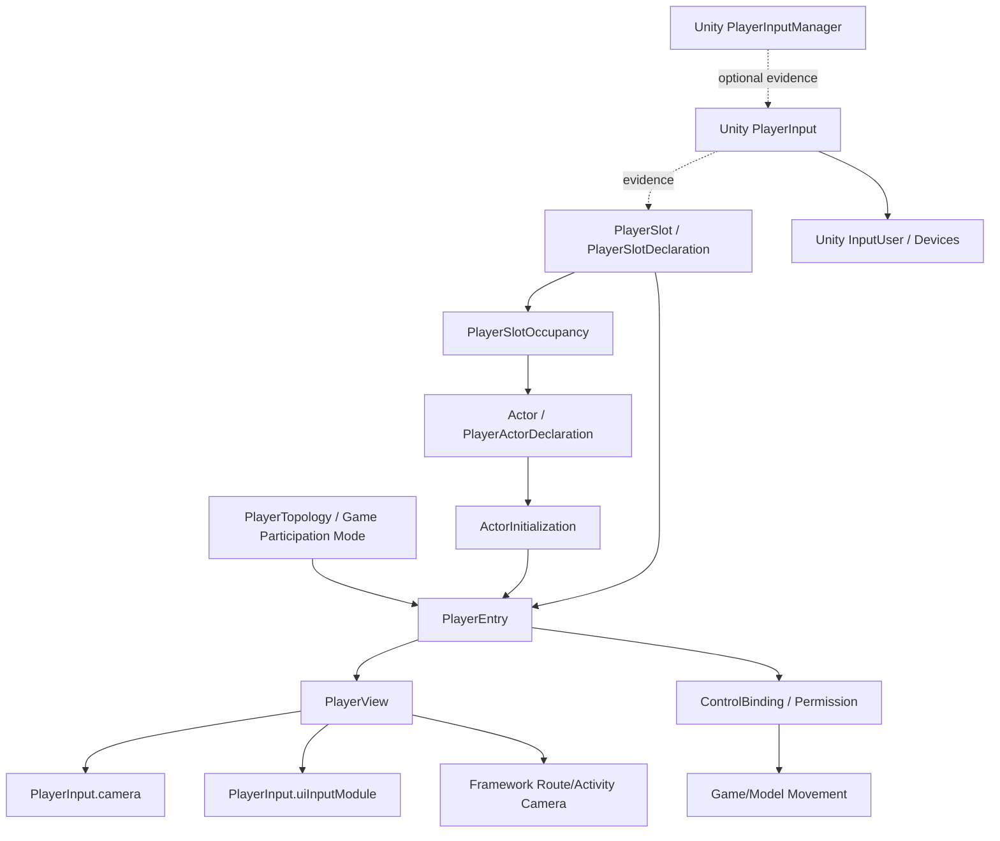
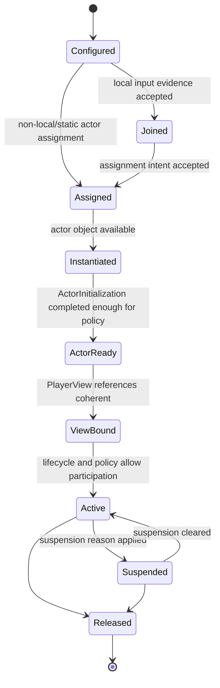

# F49-ADR-000 — Player Topology, Entry and View Ownership Overview

Status: Proposed / Planning ADR  
Phase: F49 — Player Topology, Player Entry and PlayerView Ownership  
Type: Overview / Concept Map / Boundary Summary  
Last updated: 2026-07-07

---

## 1. Context

F49 aligns the framework's next player-facing foundation after the existing identity bridges:

```text
PlayerSlot identity
PlayerActor identity
PlayerSlotOccupancy
PlayerInput gate bridge
Reset subject Actor bridge
Route/Activity camera director
Route/Activity BGM director
Pause/Transition/Loading gates
```

The framework already has useful pieces, but it does not yet define the complete entry path from "there is a player" to "this player is playable".

This ADR is the overview for the F49 ADR set. It consolidates vocabulary, state mapping, ownership boundaries and default precedence rules.

---

## 2. Problem

The framework needs to avoid several common Unity framework failures:

```text
PlayerInput treated as player identity.
ActorDeclaration treated as actor readiness.
PlayerSlotOccupancy treated as control permission.
Camera target treated as actor ownership.
Route/Activity camera treated as player viewport camera.
PlayerInputManager treated as mandatory framework runtime.
Movement implementation embedded in framework core.
```

F49 defines the conceptual boundaries before implementation.

---

## 3. Decision Summary

```text
PlayerTopology defines validation and participation rules.
PlayerEntry defines the playable-entry state flow.
ActorInitialization defines readiness of the Actor instance.
PlayerView defines local view ownership for a PlayerSlot.
Unity PlayerInput remains operational evidence.
Unity PlayerInputManager remains optional integration.
Game/model supplies assignment intent and concrete movement.
Framework admits, validates, diagnoses and coordinates boundaries.
```

---

## 4. Component Map



---

## 5. Canonical PlayerEntry Flow



`ActorReady` is the PlayerEntry observation of ActorInitialization readiness. It does not replace the ActorInitialization lifecycle.

---

## 6. State Mapping

| PlayerEntry State | Meaning | Related ActorInitialization Evidence | Camera/View Consequence |
|---|---|---|---|
| `Configured` | Slot/policy exists | None required | Route/Activity/default camera covers |
| `Joined` | Local input evidence exists | None required | Route/Activity/default camera may still cover |
| `Assigned` | Slot has selected/pending Actor | Actor identity known | Target may still be unavailable |
| `Instantiated` | Actor object exists | Instance known | Target may be resolvable but not ready |
| `ActorReady` | ActorInitialization completed enough for policy | `ReadyForView` and/or `ReadyForControl` evidence | PlayerView may bind if policy allows |
| `ViewBound` | Camera/UI/HUD/target references coherent | Usually `ReadyForView` | PlayerView can become candidate |
| `Active` | PlayerView/control participation allowed | Depends on topology and control policy | Active PlayerView may win camera precedence |
| `Suspended` | Player exists but cannot win view/control | Existing readiness may remain | Route/Activity/cinematic camera may cover |
| `Released` | Entry is no longer active | Released/invalidated | Route/Activity/default camera covers |

---

## 7. Suspension Reasons

`Suspended` is a state. It must carry a reason for diagnostics and policy.

Initial vocabulary:

```text
CinematicOverride
Transition
Loading
Pause
Respawn
ActorNotReady
ViewUnavailable
InputUnavailable
ControlBlocked
RouteExit
Manual
Unknown
```

Rules:

```text
Suspended without a reason is not acceptable for diagnostics.
Suspension may block view, control, or both depending on policy.
A suspended PlayerView must not silently win camera precedence.
```

---

## 8. Assignment Authority

Canonical split:

```text
Unity provides operational evidence: PlayerInput, InputUser, devices, callbacks.
Game/model supplies assignment intent: which slot, which actor, which character choice, which mode.
Framework admits, validates and coordinates assignment boundaries.
```

The framework should not decide game-specific character selection by itself.

Example:

```text
Player 1 selects Character A.
Game/model creates assignment intent.
Framework validates slot availability, actor identity/readiness, topology rules and view/control requirements.
Unity PlayerInput supplies local input evidence.
```

---

## 9. Assignment Request / Result Shape

This is conceptual shape, not a frozen C# API.

### PlayerEntryAssignmentRequest

```text
requestedSlot
assignmentSource / reason
playerTopology
localPlayerInput evidence, optional
inputUser evidence, optional
selectedActor candidate, optional
selectedActorPrefab/content reference, optional
characterSelection context, optional
requestedView policy, optional
requestedControl policy, optional
```

### PlayerEntryAssignmentResult

```text
status
assignedSlot
assignedActor
actorInstantiationStatus
actorReadinessStatus
viewBindingStatus
controlBindingStatus
suspensionReason, optional
issues
blockingIssueCount
```

Guardrail:

```text
Do not expose test-only diagnostic configuration methods as gameplay assignment API.
Runtime assignment needs explicit request/result semantics.
```

---

## 10. Camera Precedence Summary

Default precedence:

```text
Explicit Cinematic Override
> Active PlayerView Camera
> Activity Camera
> Route Camera
> Default Camera
```

Rules:

```text
PlayerView wins only when Bound + Active.
Configured/Joined/Assigned/Instantiated is not enough.
Route/Activity camera remains valid for menu, intro, selection, cutscene, loading, actor-not-ready and fallback coverage.
```

---

## 11. Ownership Summary

| Concern | Owner |
|---|---|
| Device pairing | Unity Input System / InputUser |
| PlayerInput creation | Scene authoring, PlayerInputManager or game bootstrap |
| Join evidence | Unity PlayerInput / PlayerInputManager / game policy |
| Assignment intent | Game/model |
| Assignment admission/validation | Framework |
| Player identity | Framework PlayerSlot |
| Actor identity | Framework Actor |
| Actor internal setup | Game/model through ActorInitialization contract |
| Player view ownership | Framework PlayerView semantics |
| Player viewport camera reference | Unity PlayerInput.camera |
| Route/Activity fallback camera | Framework Camera |
| UI input module | Unity InputSystemUIInputModule / PlayerInput.uiInputModule |
| Movement implementation | Game/model |
| Control permission/binding diagnostics | Framework boundary, game adapter |

---

## 12. Deferred Work

The ADR set intentionally defers concrete implementation of:

```text
PlayerEntryCoordinator
ActorInitializer interface
ControlBinding component
PlayerViewDeclaration component
PlayerInputManager join bridge
PlayerView registry
Camera director registry
Cinemachine channels per slot
HUD binding contracts
Save/snapshot schema
Online authority model
```

The boundaries here should guide those later cuts without forcing premature APIs.

---

## 13. Consequences

Positive:

```text
The framework gets a stable language for player entry before implementing more runtime.
Single-player remains simple.
Local multiplayer and online are not blocked by bad assumptions.
Route/Activity camera remains useful.
Unity Input System remains the mechanical owner of input/split-screen/UI input.
```

Tradeoffs:

```text
More vocabulary must be documented.
Validators will need topology-aware severity later.
Implementation requires careful avoidance of duplicate managers/registries too early.
```

---

## 14. Status

This ADR is a planning overview for F49. It does not implement runtime behavior.
