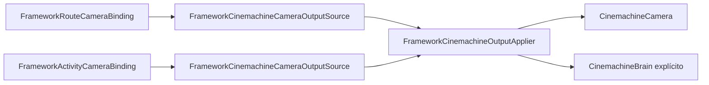

# Camera — Canonical Route/Activity Architecture

Status: C8B4C, consolidado por C8B6.

## Autoridade única

Route/Activity camera bindings usam somente output Cinemachine explícito. Não existe director de rigs, fallback de câmera ou autoridade paralela.



## Route

Ao entrar, `FrameworkRouteCameraBinding` exige `CinemachineOutputSource` e chama `TryCreateOutput` seguido de `FrameworkCinemachineOutputApplier.Apply`. Output ausente ou inválido gera diagnóstico explícito; não há fallback.

Ao sair, não há clear automático de prioridade. Qualquer contrato de release/rebaixamento deve ser implementado em um novo corte runtime explícito.

## Activity

Ao entrar, `FrameworkActivityCameraBinding`:

- com `UseOwn`, aplica o output explícito;
- com `UseRoute`, registra que não há override Activity;
- sem source, bloqueia com erro explícito;
- com source inválido, retorna `Blocked` ou `Skipped` conforme requiredness.

Ao sair, não há clear automático de prioridade. Não usar `SetActive` ou `Camera.enabled` como substituto implícito.

## Componentes

`FrameworkCinemachineCameraOutputSource` contém as referências explícitas de câmera, brain, Follow, LookAt, priority e requiredness.

`FrameworkCinemachineOutputApplier` valida e aplica somente priority e targets. Não busca objetos, não escolhe lifecycle, não ativa GameObjects e não altera `Camera.enabled`.

## Removido

O corte removeu `FrameworkCameraDirector`, `FrameworkCameraAnchorHost`, descriptors de rig/priority/scope, `IFrameworkCameraRigApplier` e `FrameworkCinemachineRigApplier`. Esses conceitos não fazem parte do caminho ativo e não devem ser recriados no consumidor.

## Product Surface

`CameraComposer` permanece a superfície oficial de produto. Route/Activity são integrações técnicas que consomem output explícito.

Guia de uso: [`Camera-Product-Usage.md`](Camera-Product-Usage.md).

## QA

Use os menus:

```text
Immersive Framework/QA/Camera/C8B4C Canonical Route Activity Cinemachine Smoke
Immersive Framework/QA/Camera/C8B2 Cinemachine Output Applier Smoke
Immersive Framework/QA/Camera/C7 Camera Product Surface Regression Smoke
```

O smoke C8B4C não cria `FrameworkCameraDirector` e verifica que `Camera.enabled` e `GameObject.activeSelf` permanecem inalterados.
