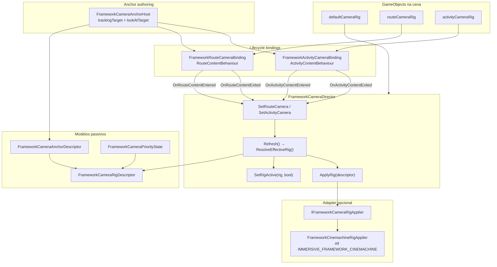
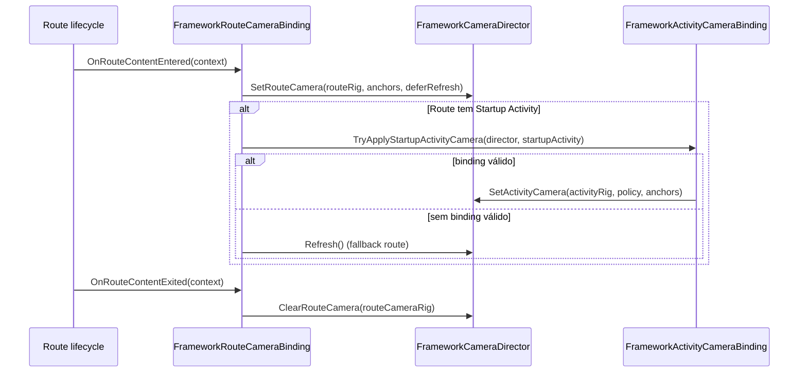
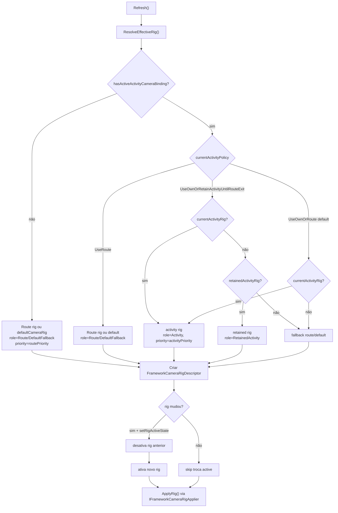
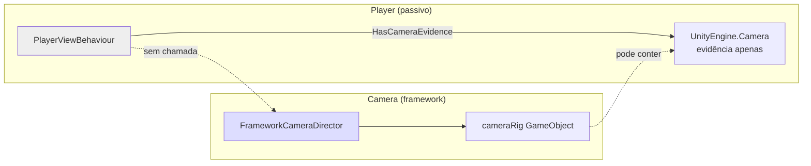
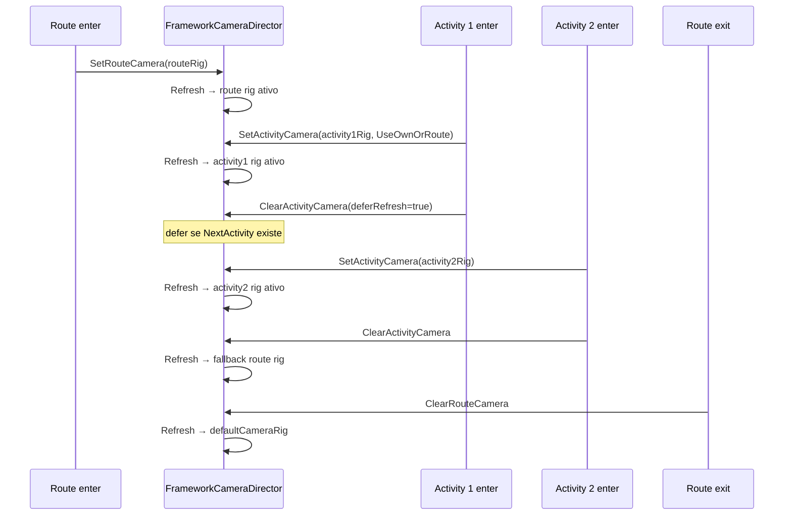

# Camera — Arquitetura e Fluxo (derivado do código)

> **Fonte:** análise direta de `Runtime/Camera/`. Este documento descreve o que o código **faz hoje**.
>
> **Status geral:** contratos marcados como `Experimental` via `[FrameworkApiStatus]` (F46B/F46C).

---

## Princípio central

O framework possui um **`FrameworkCameraDirector`** que é o único ponto de **precedência** de câmera Route/Activity. Ele:

- recebe rigs de câmera via bindings de lifecycle (`FrameworkRouteCameraBinding`, `FrameworkActivityCameraBinding`);
- resolve qual rig é efetivo conforme política de Activity;
- ativa/desativa GameObjects de rig (`setRigActiveState`);
- delega aplicação concreta (prioridade, targets) a um **`IFrameworkCameraRigApplier`** opcional (ex.: Cinemachine).

O director **não** integra com `PlayerView`, `PlayerEntry` ou `PlayerSlot`. `PlayerViewBehaviour` apenas guarda evidência de `Camera` como flag diagnóstica — não chama o director.

`ImmersiveFrameworkBootstrap` declara explicitamente que lifecycle de Camera **não é owned** no bootstrap.

---

## Visão geral da arquitetura



---

## Componentes Unity

### FrameworkCameraDirector

Arquivo: `Runtime/Camera/Unity/FrameworkCameraDirector.cs`

| Campo | Default | Papel |
|-------|---------|-------|
| `defaultCameraRig` | — | Fallback quando não há route/activity |
| `defaultAnchors` | — | Anchors do fallback |
| `routePriority` | 20 | Prioridade numérica do rig Route |
| `activityPriority` | 100 | Prioridade numérica do rig Activity |
| `setRigActiveState` | true | Desativa rig anterior, ativa o novo |
| `rigApplier` | — | MonoBehaviour que implementa `IFrameworkCameraRigApplier` |
| `logTransitions` | true | Log `[FRAMEWORK_CAMERA]` |

**Estado interno rastreado:**

- `currentRouteRig` / `currentRouteAnchors`
- `currentActivityRig` / `currentActivityAnchors`
- `retainedActivityRigForCurrentRoute` — para política de retenção
- `hasActiveActivityCameraBinding` — se houve binding de activity neste ciclo
- `currentActivityPolicy`
- `currentEffectiveRig` / `currentEffectiveDescriptor`

### FrameworkRouteCameraBinding

Arquivo: `Runtime/Camera/Unity/FrameworkRouteCameraBinding.cs`

Herda `RouteContentBehaviour`:



`deferRefreshForStartupActivity = true` quando a Route tem Startup Activity — evita flash da câmera Route antes da Activity startup.

### FrameworkActivityCameraBinding

Arquivo: `Runtime/Camera/Unity/FrameworkActivityCameraBinding.cs`

Herda `ActivityContentBehaviour`:

| Evento | Ação |
|--------|------|
| `OnActivityContentEntered` | `director.SetActivityCamera(activityCameraRig, policy, anchors)` |
| `OnActivityContentExited` | `director.ClearActivityCamera(rig, deferRefresh)` |

`deferRefreshForActivityTransition = true` quando `context.NextActivity != null` — evita refresh intermediário na troca Activity→Activity.

Também expõe `TryApplyStartupActivityCamera()` para uso pelo Route binding na entrada da Route.

### FrameworkCameraAnchorHost

Arquivo: `Runtime/Camera/Unity/FrameworkCameraAnchorHost.cs`

- `trackingTarget` — Transform de follow
- `lookAtTarget` — Transform de look-at
- `ToDescriptor()` → `FrameworkCameraAnchorDescriptor`

Usado pelos bindings e repassado ao applier via `FrameworkCameraRigDescriptor`.

---

## Resolução de precedência (`Refresh`)



### Políticas de Activity (`FrameworkCameraActivityPolicy`)

| Política | Comportamento |
|----------|---------------|
| `UseOwnOrRoute` (default) | Usa activity rig se presente; senão route/default |
| `UseOwnOrRetainActivityUntilRouteExit` | Mantém última activity rig até sair da Route |
| `UseRoute` | Ignora activity rig; força route/default |

---

## Prioridades numéricas

| Rig | Prioridade default | Papel |
|-----|-------------------|-------|
| Route / Default | `routePriority` (20) | Câmera base da Route |
| Activity / Retained | `activityPriority` (100) | Câmera da Activity (maior precedência) |

Valores passados ao applier via `FrameworkCameraPriorityState` dentro do descriptor.

---

## Adapter Cinemachine (opcional)

Arquivo: `Runtime/Camera/Cinemachine/FrameworkCinemachineRigApplier.cs`

Compilado apenas com `#if IMMERSIVE_FRAMEWORK_CINEMACHINE` (asmdef separado: `Immersive.Framework.Camera.Cinemachine`).

Implementa `IFrameworkCameraRigApplier`:

1. `Supports(descriptor)` — rig tem `CinemachineCamera` em children
2. `Apply(descriptor)`:
   - `cinemachineCamera.Priority = descriptor.Priority.Priority`
   - Se anchors presentes: `TrackingTarget` e `LookAtTarget`

Sem applier configurado, o director apenas troca `GameObject.SetActive` nos rigs (se `setRigActiveState`).

---

## Contrato do applier

Arquivo: `Runtime/Camera/IFrameworkCameraRigApplier.cs`

```csharp
bool Supports(FrameworkCameraRigDescriptor descriptor);
void Apply(FrameworkCameraRigDescriptor descriptor);
```

O director valida que `rigApplier` implementa a interface; caso contrário loga erro e pula aplicação.

---

## Modelos e enums

### FrameworkCameraRigDescriptor

Arquivo: `Runtime/Camera/FrameworkCameraRigDescriptor.cs`

Struct readonly com: `Rig`, `Role`, `Scope`, `Anchors`, `Priority`, `Source`, `Reason`.

`IsValid` exige rig não-nulo, role/scope conhecidos e priority válida.

### FrameworkCameraRigRole

| Valor | Significado |
|-------|-------------|
| `DefaultFallback` | Rig default do director |
| `Route` | Selecionado pela Route |
| `Activity` | Selecionado pela Activity ativa |
| `RetainedActivity` | Activity retida até sair da Route |

### FrameworkCameraScope

| Valor | Significado |
|-------|-------------|
| `DefaultFallback` | Escopo fallback |
| `Route` | Autoria Route |
| `Activity` | Autoria Activity |

### FrameworkCameraPriorityState

Arquivo: `Runtime/Camera/FrameworkCameraPriorityState.cs`

Empacota `role`, `priority` int, `source`, `reason` para diagnóstico.

### FrameworkCameraAnchorDescriptor

Arquivo: `Runtime/Camera/FrameworkCameraAnchorDescriptor.cs`

Struct com `TrackingTarget`, `LookAtTarget`, `HasAnyTarget`, `Empty` factory.

---

## Inventário de arquivos

### Core (`Runtime/Camera/`)

| Arquivo | Papel |
|---------|-------|
| `IFrameworkCameraRigApplier.cs` | Contrato do adapter de pacote de câmera |
| `FrameworkCameraRigDescriptor.cs` | Descriptor do rig selecionado |
| `FrameworkCameraAnchorDescriptor.cs` | Descriptor de targets follow/look-at |
| `FrameworkCameraPriorityState.cs` | Estado de prioridade |
| `FrameworkCameraRigRole.cs` | Papel do rig efetivo |
| `FrameworkCameraScope.cs` | Escopo de autoria |
| `FrameworkCameraActivityPolicy.cs` | Política Route vs Activity |

### Unity bindings (`Runtime/Camera/Unity/`)

| Arquivo | Papel |
|---------|-------|
| `FrameworkCameraDirector.cs` | Director de precedência |
| `FrameworkRouteCameraBinding.cs` | Binding Route → director |
| `FrameworkActivityCameraBinding.cs` | Binding Activity → director |
| `FrameworkCameraAnchorHost.cs` | Provider de anchors na cena |

### Cinemachine (`Runtime/Camera/Cinemachine/`)

| Arquivo | Papel |
|---------|-------|
| `FrameworkCinemachineRigApplier.cs` | Adapter Cinemachine 3 |
| `Immersive.Framework.Camera.Cinemachine.asmdef` | Assembly condicional |

---

## Relação com Player (sem integração direta)



`PlayerView` documenta câmera como evidência passiva. `PlayerViewTopologyValidator` valida topologia, não ativa câmera. A seleção efetiva de câmera é responsabilidade do `FrameworkCameraDirector` + bindings de Route/Activity.

---

## Cena típica

```
Session / Bootstrap
└── FrameworkCameraDirector
      defaultCameraRig = MainCameraFallback
      rigApplier = CinemachineRigApplier
      routePriority = 20
      activityPriority = 100

Route Content (scene da Route)
├── FrameworkRouteCameraBinding
│     routeCameraRig = RouteCameraRig
│     routeAnchors = RouteAnchorHost
│     director → ref ao director da sessão
│     startupActivityCameraBinding → opcional
└── RouteCameraRig (GameObject)
      └── CinemachineCamera(s)

Activity Content (scene da Activity)
├── FrameworkActivityCameraBinding
│     assignedActivity = MyActivityAsset
│     activityCameraRig = ActivityCameraRig
│     policy = UseOwnOrRoute
│     anchors = ActivityAnchorHost
│     director → ref ao director da sessão
└── ActivityCameraRig (GameObject)

FrameworkCameraAnchorHost (em rig ou separado)
  trackingTarget = PlayerTransform
  lookAtTarget = PlayerTransform
```

---

## Fluxo completo Route → Activity → Activity



Com `UseOwnOrRetainActivityUntilRouteExit`, após sair da Activity 2 o director pode manter o último activity rig até `ClearRouteCamera`.

---

## O que o código não faz

| Responsabilidade | Status |
|------------------|--------|
| Binding automático PlayerView → director | Não existe |
| Seleção de câmera por PlayerSlot | Não implementado |
| Split-screen / multi-player camera | Não implementado |
| Camera shake, FOV, blend Cinemachine | Applier só seta Priority + targets |
| Validação de topologia de câmera (validator) | Não existe equivalente ao PlayerTopology |
| Integração com Gate/Pause | Director não observa Gate |
| Criação/destruição de rigs em runtime | Apenas referências a GameObjects existentes |

---

## Mapa de namespaces

```
Immersive.Framework.Camera              → descriptors, enums, contrato applier
Immersive.Framework.Camera.Cinemachine  → adapter Cinemachine (condicional)
```

Bindings ficam em `Immersive.Framework.Camera` mas herdam de:

- `RouteContentBehaviour` (`Immersive.Framework.Authoring` / Route lifecycle)
- `ActivityContentBehaviour` (`Immersive.Framework.ActivityFlow`)

---

## Referência rápida

| Necessidade | Usar |
|-------------|------|
| Câmera default da sessão | `FrameworkCameraDirector.defaultCameraRig` |
| Câmera ao entrar na Route | `FrameworkRouteCameraBinding` |
| Câmera ao entrar na Activity | `FrameworkActivityCameraBinding` |
| Manter câmera da activity entre activities | `UseOwnOrRetainActivityUntilRouteExit` |
| Forçar câmera da Route na Activity | `UseRoute` |
| Follow/look-at targets | `FrameworkCameraAnchorHost` |
| Prioridade Cinemachine | `FrameworkCinemachineRigApplier` no `rigApplier` |
| Evidência de câmera no player (passivo) | `PlayerViewBehaviour.viewCamera` (sem efeito no director) |

---

**Última revisão:** derivada do código em `master`, julho 2026.