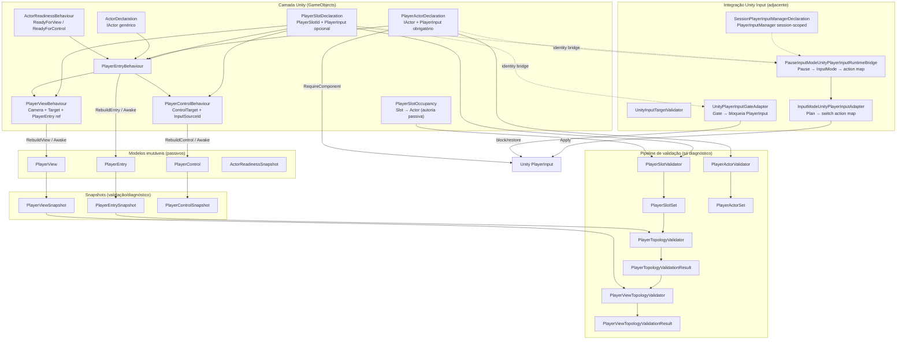
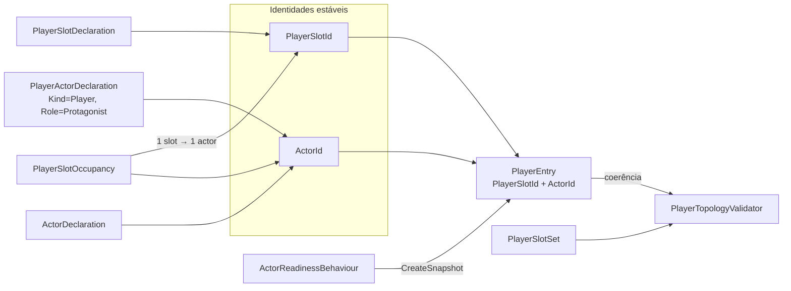
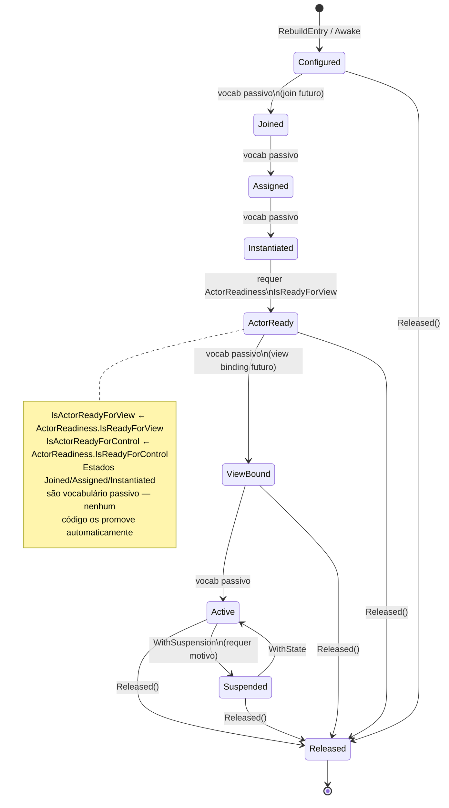
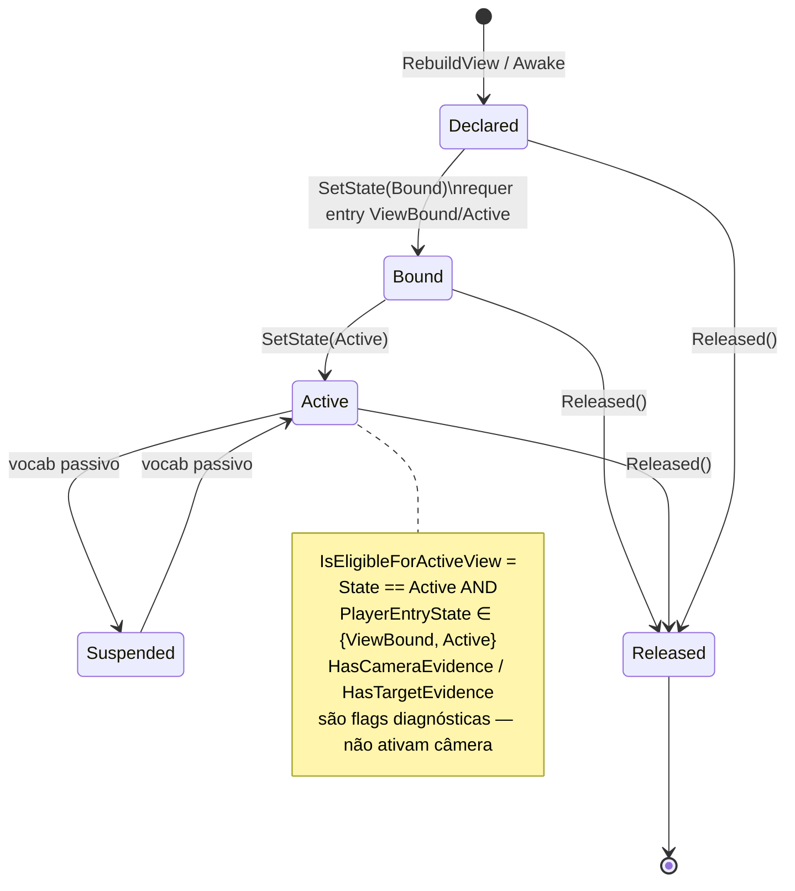
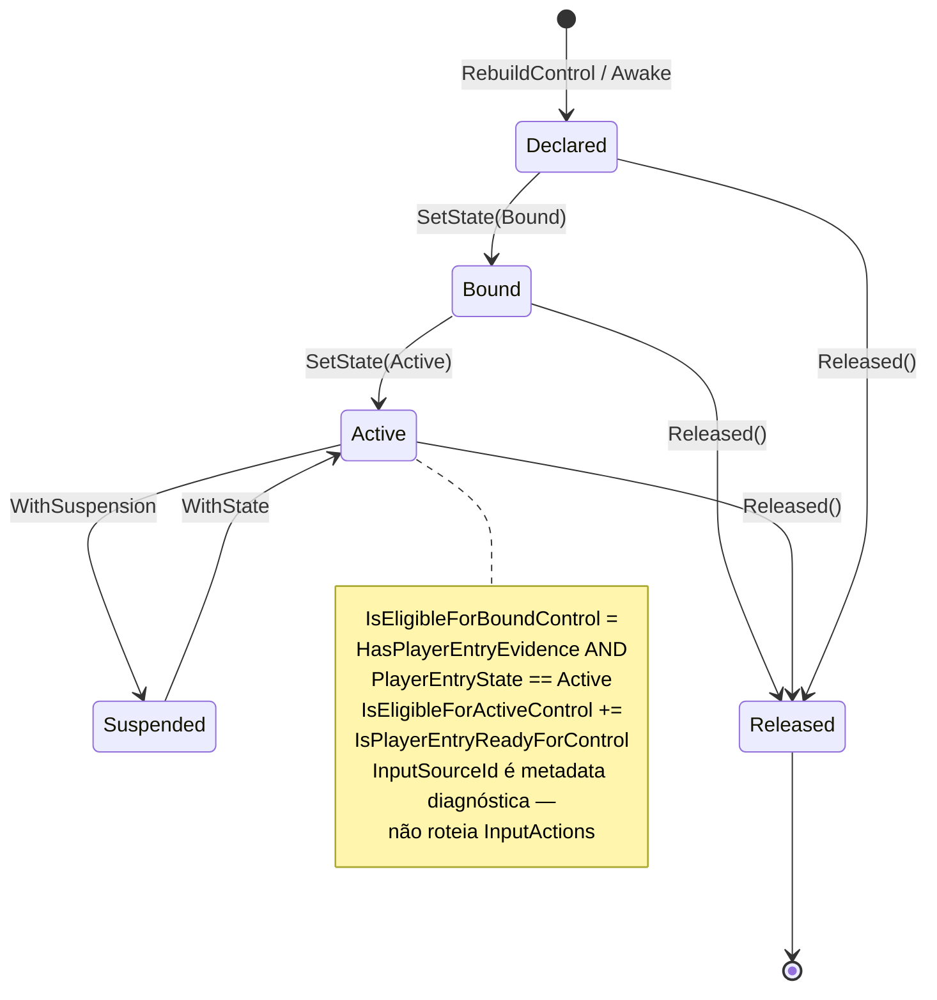
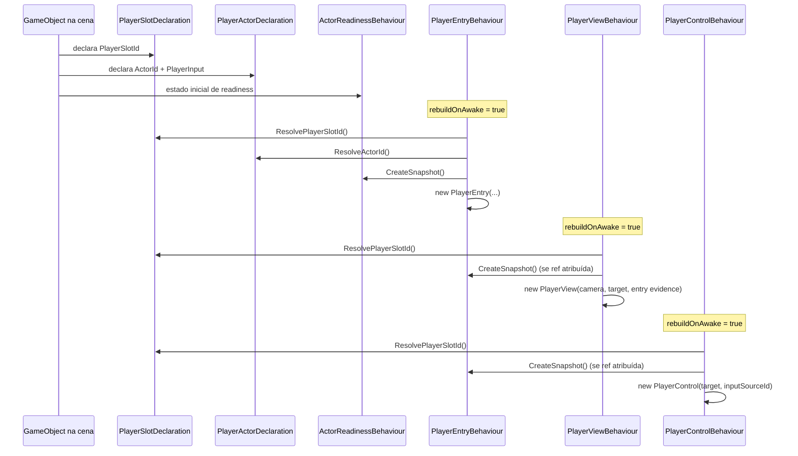
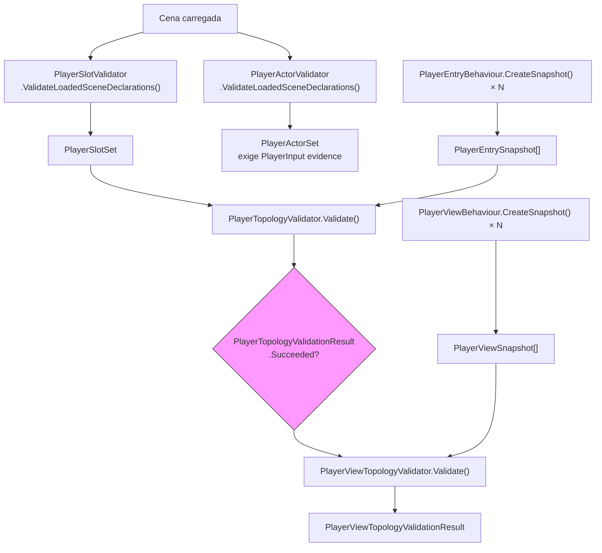
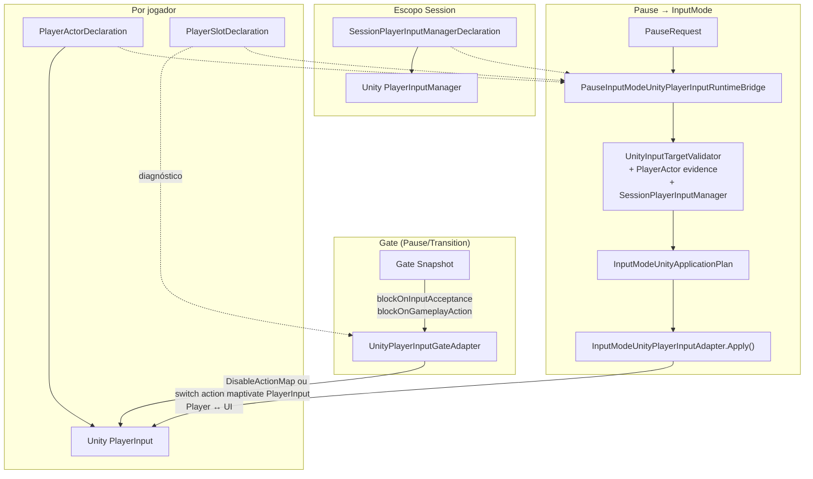

# Player — Arquitetura e Fluxo (derivado do código)

> **Fonte:** análise direta de `Runtime/`. Este documento descreve o que o código **faz hoje**, não o que os ADRs planejam para o futuro.
>
> **Status geral:** todos os contratos de player listados aqui estão marcados como `Experimental` via `[FrameworkApiStatus]`.

---

## Princípio central

O framework trata o **player como evidência passiva + validação diagnóstica**. Nenhum componente ou serviço no código atual:

- faz join de jogadores (`PlayerInputManager.JoinPlayer`);
- spawna ou materializa actors;
- ativa câmeras ou seleciona prioridade de `CameraDirector`;
- roteia `InputActions`, move o personagem ou gerencia `ControlBinding`;
- coordena o lifecycle `PlayerEntry → PlayerView → PlayerControl`.

Os modelos expõem **identidade, estado e snapshots** para consumidores futuros e para QA/diagnóstico.

---

## Visão geral da arquitetura



---

## Identidade e topologia base

### Identidades estáveis

| Tipo | Domínio (`FrameworkIdentityDomain`) | Arquivo |
|------|--------------------------------------|---------|
| `PlayerSlotId` | `PlayerSlot` (240) | `Runtime/PlayerSlots/PlayerSlotId.cs` |
| `ActorId` | `Actor` (230) | `Runtime/Actors/ActorId.cs` |

`PlayerSlotId` **não** é `PlayerInput.playerIndex`, device id, save slot ou camera channel.

### Relações de identidade



### Regras de `PlayerTopologyValidator`

Arquivo: `Runtime/PlayerTopology/PlayerTopologyValidator.cs`

- Cada `PlayerSlot` tem no máximo **1** `PlayerEntry` e **1** occupancy.
- Cada `Actor` ocupa no máximo **1** slot.
- `PlayerEntry.ActorId` deve coincidir com `PlayerSlotOccupancy.OccupiedActorId`.
- Occupancy sem entry (e vice-versa) gera issue **bloqueante**.
- Issues do `PlayerSlotSet` são propagadas para o resultado de topologia.

---

## Inventário de arquivos por camada

### PlayerSlots — assento de participação

| Arquivo | Papel |
|---------|-------|
| `PlayerSlotId.cs` | Primitiva de identidade estável do slot |
| `PlayerSlotDeclaration.cs` | MonoBehaviour: declara `PlayerSlotId`; `PlayerInput` é evidência opcional, **não** identidade |
| `PlayerSlotOccupancy.cs` | MonoBehaviour: relação passiva slot → actor (autoria, não runtime) |
| `PlayerSlotDescriptor.cs` | Descriptor imutável de declaração |
| `PlayerSlotOccupancyDescriptor.cs` | Descriptor imutável de occupancy |
| `PlayerSlotSet.cs` | Conjunto validado de descriptors + occupancies + issues |
| `PlayerSlotSetIssue.cs` / `PlayerSlotSetIssueKind.cs` | Issues de validação |
| `PlayerSlotValidator.cs` | Valida declarações da cena (`FindObjectsByType`) ou coleções explícitas |

### Actors — identidade e readiness

| Arquivo | Papel |
|---------|-------|
| `IActor.cs` | Contrato mínimo: `ActorId`, `ActorKind`, `ActorRole`, `ActorDisplayName` |
| `ActorDeclaration.cs` | MonoBehaviour genérico implementando `IActor` |
| `PlayerActorDeclaration.cs` | `IActor` com `ActorKind.Player`; **exige** `PlayerInput` como evidência |
| `PlayerActorDescriptor.cs` | Descriptor de player actor |
| `PlayerActorSet.cs` | Conjunto validado; bloqueia se faltar `PlayerInput` evidence |
| `PlayerActorSetIssue.cs` / `PlayerActorSetIssueKind.cs` | Issues de validação |
| `PlayerActorValidator.cs` | Valida declarações de `PlayerActorDeclaration` na cena |
| `ActorReadinessState.cs` | Enum: `NotReady`, `ReadyForView`, `ReadyForControl`, `Failed`, `Released` |
| `ActorReadinessBehaviour.cs` | Adapter Unity para readiness; alimenta `PlayerEntry` |
| `ActorReadiness.cs` / `ActorReadinessSnapshot.cs` | Modelo e snapshot de readiness |

### PlayerEntry — conexão slot + actor

| Arquivo | Papel |
|---------|-------|
| `IPlayerEntry.cs` | Contrato passivo: identidade, estado, readiness, snapshot |
| `PlayerEntryState.cs` | Vocabulário de estados da cadeia de entry |
| `PlayerEntry.cs` | Modelo imutável |
| `PlayerEntrySnapshot.cs` | Snapshot para validação |
| `PlayerEntryBehaviour.cs` | Adapter Unity; `RebuildEntry()` no `Awake` se `rebuildOnAwake` |

### PlayerViews — evidência de visão

| Arquivo | Papel |
|---------|-------|
| `IPlayerView.cs` | Contrato passivo: slot, estado, evidências de câmera/target/entry |
| `PlayerViewState.cs` | Vocabulário de estados da view |
| `PlayerView.cs` | Modelo imutável |
| `PlayerViewSnapshot.cs` | Snapshot para validação |
| `PlayerViewBehaviour.cs` | Adapter Unity; referencia `Camera`, `Transform`, `PlayerEntryBehaviour` |
| `PlayerViewTopologyValidator.cs` | Valida coerência entre topologia e views |
| `PlayerViewTopologyValidationResult.cs` | Resultado da validação |
| `PlayerViewTopologyIssue.cs` / `PlayerViewTopologyIssueKind.cs` | Issues de validação |

### PlayerControls — evidência de controle

| Arquivo | Papel |
|---------|-------|
| `IPlayerControl.cs` | Contrato passivo: slot, estado, evidência de entry/target/input |
| `PlayerControlState.cs` | Vocabulário de estados de controle |
| `PlayerControl.cs` | Modelo imutável |
| `PlayerControlSnapshot.cs` | Snapshot para validação |
| `PlayerControlBehaviour.cs` | Adapter Unity; referencia `controlTarget`, `inputSourceId`, `PlayerEntryBehaviour` |

> **Nota:** não existe `PlayerControlTopologyValidator` no código atual.

### PlayerTopology — validação de coerência

| Arquivo | Papel |
|---------|-------|
| `PlayerTopologyValidator.cs` | Cruza `PlayerSlotSet` + `PlayerEntrySnapshot[]` |
| `PlayerTopologyValidationResult.cs` | Resultado com issues propagadas |
| `PlayerTopologyIssue.cs` / `PlayerTopologyIssueKind.cs` | Issues de topologia |

### Unity Input — fronteira adjacente ao player

| Arquivo | Papel |
|---------|-------|
| `SessionPlayerInputManagerDeclaration.cs` | Evidência session-scoped de `PlayerInputManager` |
| `UnityInputTargetValidator.cs` | Valida declarações de alvos de input |
| `UnityInputTargetRole.cs` | Papéis: `GlobalUiPause`, `GameplayCommands` |
| `UnityPlayerInputGateAdapter.cs` | Bloqueia `PlayerInput` conforme Gate (Pause/Transition) |
| `UnityPlayerInputGateBlockMode.cs` | Modo de bloqueio: desabilitar action map ou desativar componente |
| `PauseInputModeUnityPlayerInputRuntimeBridge.cs` | Bridge opt-in: Pause request → InputMode → `PlayerInput` |
| `InputModeUnityPlayerInputAdapter.cs` | Aplica plano de InputMode em instância explícita de `PlayerInput` |

### Diagnostics — QA smoke runners relacionados

| Arquivo | Papel |
|---------|-------|
| `PlayerActorIdentityQaSmokeRunner.cs` | Smoke de identidade de `PlayerActor` |
| `SessionPlayerInputManagerBoundaryQaSmokeRunner.cs` | Smoke de fronteira do `PlayerInputManager` |
| `InputModeUnityPlayerInputAdapterQaSmokeRunner.cs` | Smoke do adapter de InputMode |
| `InputModeUnityPlayerInputApplicationQaSmokeRunner.cs` | Smoke de aplicação de InputMode |
| `InputModeUnityPlayerInputRequestApplicationQaSmokeRunner.cs` | Smoke de request application |
| `PauseInputModeUnityPlayerInputApplicationQaSmokeRunner.cs` | Smoke de Pause + InputMode application |
| `PauseInputModeUnityPlayerInputRuntimeBridgeQaSmokeRunner.cs` | Smoke da bridge Pause → PlayerInput |

Disparados via `Runtime/Diagnostics/FrameworkQaCanvas.cs`.

---

## Cadeias de estado

### PlayerEntry

Arquivo: `Runtime/PlayerEntry/PlayerEntryState.cs`



**Transições com efeito no código (`PlayerEntry.cs`):**

- `WithState(state)` — nova instância imutável; valida readiness para estados que exigem `IsReadyForView`.
- `WithActorReadiness(snapshot)` — atualiza evidência de readiness.
- `WithSuspension(reason)` — força `Suspended`; exige motivo não vazio.
- `Released()` — força `Released`.

Estados que exigem `ActorReadiness.IsReadyForView`: `ActorReady`, `ViewBound`, `Active`, `Suspended`.

### PlayerView

Arquivo: `Runtime/PlayerViews/PlayerViewState.cs`



**Evidências coletadas em `RebuildView()` (`PlayerViewBehaviour.cs`):**

- `viewCamera != null` → `HasCameraEvidence`
- `viewTarget != null` → `HasTargetEvidence`
- `playerEntryBehaviour != null` → amostra `PlayerEntrySnapshot`; valida que `PlayerSlotId` coincide

### PlayerControl

Arquivo: `Runtime/PlayerControls/PlayerControlState.cs`



---

## Bootstrap em runtime (Awake)

Todos os behaviours com `rebuildOnAwake = true` constroem o modelo imutável no `Awake`. Configuração inválida lança `InvalidOperationException` explicitamente.



### Resolução de identidade em `PlayerEntryBehaviour`

Ordem de precedência:

1. **PlayerSlotId:** `PlayerSlotDeclaration` → fallback `playerSlotId` serializado.
2. **ActorId:** `ActorDeclaration` e/ou `PlayerActorDeclaration` (devem concordar) → fallback `actorId` serializado.
3. **ActorReadiness:** `ActorReadinessBehaviour.CreateSnapshot()` → fallback estado/reason serializados.

---

## Pipeline de validação



### Checks de `PlayerViewTopologyValidator`

Arquivo: `Runtime/PlayerViews/PlayerViewTopologyValidator.cs`

| Check | Condição bloqueante |
|-------|---------------------|
| Topologia ausente | `playerTopology == null` |
| Issues propagadas | Qualquer issue bloqueante de `PlayerTopology` |
| View duplicada | Mais de uma view não-`Released` por slot |
| Slot não declarado | View referencia slot fora do `PlayerSlotSet` |
| Entry ausente | Slot da view não tem `PlayerEntry` na topologia |
| Estado stale | `view.PlayerEntryState != entry.State` quando `HasPlayerEntryEvidence` |
| Bound sem entry pronto | View `Bound` com entry fora de `ViewBound`/`Active` |
| Active sem entry pronto | View `Active` com entry fora de `ViewBound`/`Active` |

Views em estado `Released` são ignoradas na contagem de participantes.

---

## Integração Unity Input

A integração com `PlayerInput` / `PlayerInputManager` existe como **adaptadores opt-in na borda**. Eles referenciam identidade de player (`PlayerSlotDeclaration`, `PlayerActorDeclaration`) apenas para diagnóstico — não substituem nem resolvem `PlayerInput`.



### `UnityPlayerInputGateAdapter`

- Observa Gate snapshot a cada `Update`.
- Bloqueia quando `blockOnInputAcceptance` e/ou `blockOnGameplayAction` estão ativos.
- Modos: `DisableActionMap` (mapa `Player` por padrão) ou desativar o componente `PlayerInput`.
- Restaura estado anterior se `restorePreviousState = true`.

### `PauseInputModeUnityPlayerInputRuntimeBridge`

- Submete `PauseRequest` ao runtime do framework.
- Após preflight seguro, aplica InputMode em **uma** instância explícita de `PlayerInput`.
- Pode auto-descobrir `UnityInputTargetDeclaration[]`, `PlayerActorDeclaration[]`, `SessionPlayerInputManagerDeclaration[]`.
- Não chama `JoinPlayer`, não spawna players, não lê comandos de gameplay.

---

## Cena típica (composição sugerida)

Um GameObject de jogador pode acumular:

```
GameObject "Player"
├── PlayerSlotDeclaration          → player.1
├── PlayerActorDeclaration         → qa.actor.player.primary + PlayerInput
├── ActorReadinessBehaviour        → NotReady → ReadyForView/Control
├── PlayerSlotOccupancy            → player.1 ocupa qa.actor.player.primary
├── PlayerEntryBehaviour           → conecta slot + actor + readiness
├── PlayerViewBehaviour            → camera + target + ref ao PlayerEntry
├── PlayerControlBehaviour         → controlTarget + inputSourceId + ref ao PlayerEntry
├── UnityPlayerInputGateAdapter    → (opt-in) bloqueia input em pause/transition
└── PlayerInput                    → componente Unity obrigatório no PlayerActor
```

`SessionPlayerInputManagerDeclaration` costuma ficar em um GameObject separado no escopo da sessão.

---

## O que o código não faz (ainda)

| Responsabilidade | Status no código |
|------------------|------------------|
| Join de jogadores (`PlayerInputManager.JoinPlayer`) | Não implementado |
| Spawn / materialização de Actor | Não implementado |
| Ativar câmera / `CameraDirector` | Não implementado |
| Binding de controle / movimento | Não implementado |
| Coordinator de lifecycle Entry → View → Control | Não existe |
| `PlayerControlTopologyValidator` | Não existe |
| Integração com Snapshot / Preferences | Sem referência a player |
| Promoção automática de estados `Joined` → `Active` | Não existe — vocabulário passivo |

---

## Mapa de namespaces

```
Immersive.Framework.PlayerSlots     → identidade do assento
Immersive.Framework.Actors          → identidade do actor + readiness
Immersive.Framework.PlayerEntry     → conexão slot↔actor
Immersive.Framework.PlayerViews     → evidência de visão + validação de topologia de view
Immersive.Framework.PlayerControls  → evidência de controle
Immersive.Framework.PlayerTopology  → validação de coerência slot/entry
Immersive.Framework.UnityInput      → fronteira com PlayerInput/PlayerInputManager
Immersive.Framework.InputMode       → Pause/InputMode → PlayerInput
Immersive.Framework.Identity        → FrameworkIdentityDomain (PlayerSlot=240, Actor=230)
```

---

## Referência rápida de elegibilidade

| Propriedade | Condição (código) |
|-------------|-------------------|
| `PlayerEntry.IsActorReadyForView` | `ActorReadiness.IsReadyForView` |
| `PlayerEntry.IsActorReadyForControl` | `ActorReadiness.IsReadyForControl` |
| `PlayerView.IsEligibleForActiveView` | `State == Active` **e** `PlayerEntryState ∈ {ViewBound, Active}` |
| `PlayerControl.IsEligibleForBoundControl` | `HasPlayerEntryEvidence` **e** `PlayerEntryState == Active` |
| `PlayerControl.IsEligibleForActiveControl` | `IsEligibleForBoundControl` **e** `IsPlayerEntryReadyForControl` |

---

## Atualização deste documento

Revisar quando novos cortes adicionarem:

- coordinator de lifecycle;
- `PlayerControlTopologyValidator`;
- binding real de view/control;
- integração com Snapshot ou save/load de estado de player.

**Última revisão:** derivada do código em `master`, julho 2026.