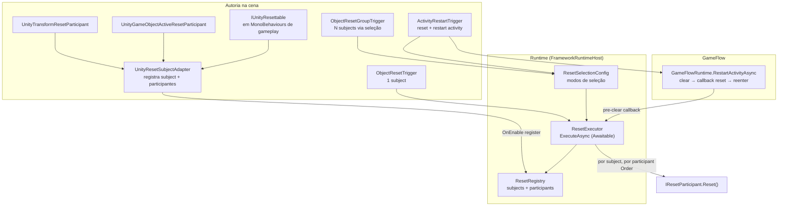
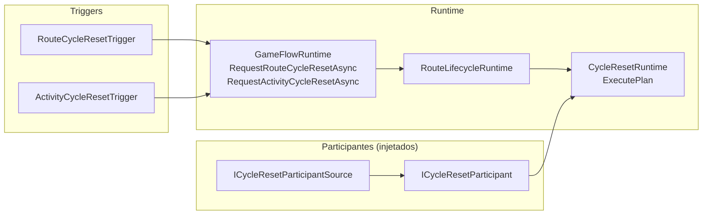
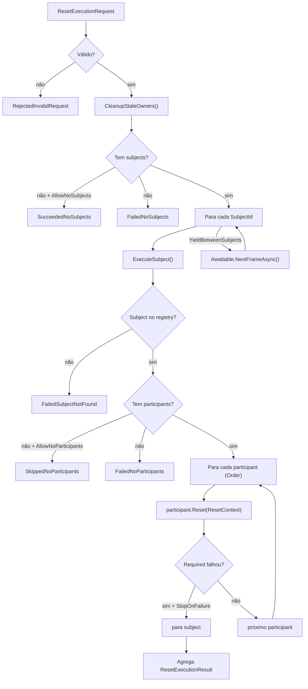
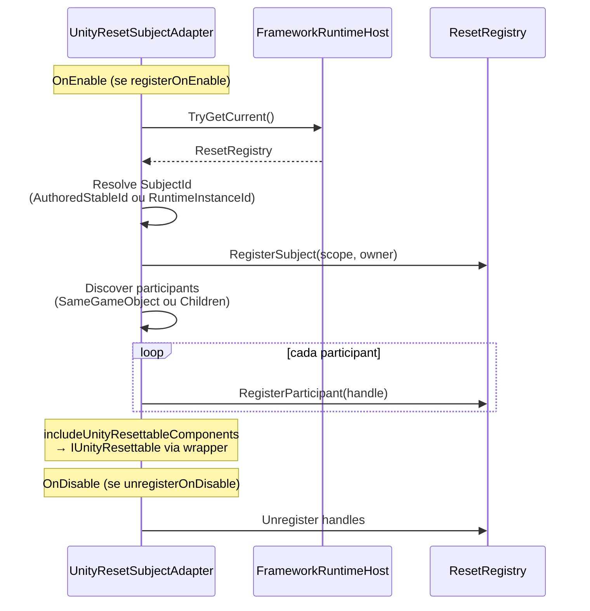
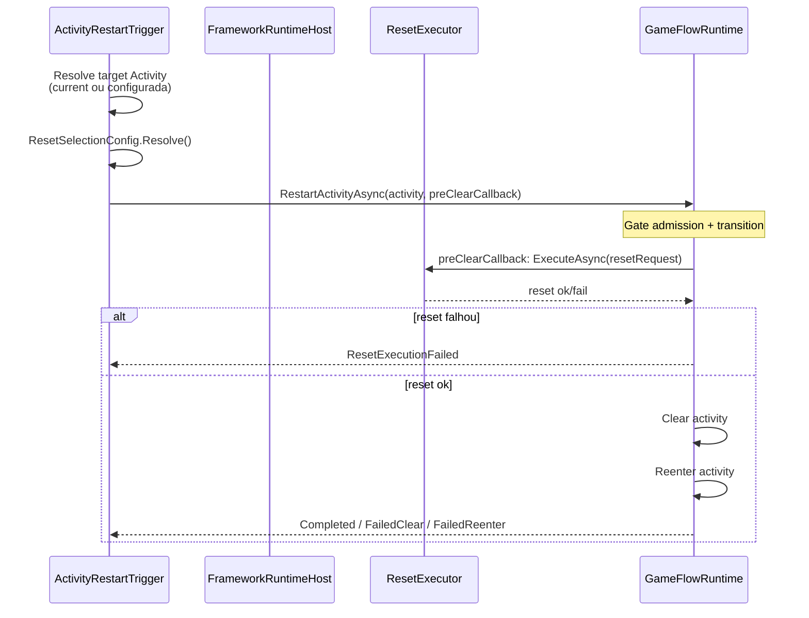

# Reset — Arquitetura e Fluxo (derivado do código)

> **Fonte:** análise direta de `Runtime/` e `Editor/Validation/`. Este documento descreve o que o código **faz hoje**.
>
> **Status geral:** contratos marcados como `Experimental` via `[FrameworkApiStatus]`.

---

## Princípio central

O framework possui **dois sistemas de reset distintos** que não devem ser confundidos:

| Sistema | Namespace | O que reseta |
|---------|-----------|--------------|
| **Object Reset** | `Immersive.Framework.Reset` | Objetos/componentes Unity via `ResetSubject` + participantes síncronos |
| **Cycle Reset** | `Immersive.Framework.CycleReset` | Ciclo de lifecycle Route/Activity via participantes de framework |

**Object Reset** é o caminho principal para resetar estado de gameplay (transform, active, componentes custom). Ele **não consulta** `ObjectEntryRuntimeContextSnapshot` e **não depende** de `ObjectEntryDeclaration` — isso está explícito em `ResetRegistry` e `UnityResetSubjectAdapter`.

**Cycle Reset** não reseta transforms, players, pools ou cenas. Executa participantes registrados que decidem o que fazer localmente (`CycleResetRuntime`).

**Activity Restart** compõe Object Reset + fluxo de lifecycle (`clear` + `reenter` da Activity).

---

## Visão geral — Object Reset



---

## Visão geral — Cycle Reset (separado)



> `RouteCycleResetTrigger` declara explicitamente: *"It does not perform object, component, player, actor, pool, save or scene reload reset."*

---

## ResetRegistry — fonte de verdade

Arquivo: `Runtime/Reset/ResetRegistry.cs`

- Mantém dicionários de **subjects** e **participants** por handle.
- Suporta registro de subject **scene-authored** (`ResetSubjectOrigin.SceneAuthored`) e **runtime** (`ResetSubjectOrigin.RuntimeRegistered`).
- Gera IDs runtime com prefixo + contador (`prefix#1`, `prefix#2`, …).
- Participantes são retornados ordenados por `Descriptor.Order` (ascendente).
- `CleanupStaleOwners()` remove registros cujo owner Unity foi destruído.

`FrameworkRuntimeHost` expõe o registry lazy:

```csharp
internal ResetRegistry ResetRegistry => _resetRegistry ??= new ResetRegistry();
```

---

## ResetExecutor — orquestração

Arquivo: `Runtime/Reset/ResetExecutor.cs`

Fluxo de `ExecuteAsync(ResetExecutionRequest)`:



**Regras importantes:**

- Participantes são **síncronos**; apenas o executor usa `Awaitable`.
- `ResetParticipantRequiredness.Required` — falha bloqueia o subject.
- `Optional` — falha gera warning, não bloqueia.
- Exceções em `Reset()` viram `ResetIssueKind.Exception` e falha do participant.

### Status agregados (`ResetExecutionStatus`)

| Status | Significado |
|--------|-------------|
| `Succeeded` | Todos os subjects completaram |
| `SucceededNoSubjects` | Seleção vazia com `AllowNoSubjects` |
| `Failed` | Pelo menos um subject/participant obrigatório falhou |
| `FailedNoSubjects` | Seleção vazia sem permissão |
| `RejectedInvalidRequest` | Request inválido ou exceção na orquestração |

---

## UnityResetSubjectAdapter — registro na cena

Arquivo: `Runtime/Reset/Unity/UnityResetSubjectAdapter.cs`



### Configuração relevante

| Campo | Papel |
|-------|-------|
| `idGeneration` | `AuthoredStableId` ou `RuntimeInstanceId` (prefab runtime) |
| `scope` | `Route`, `Activity` ou `Runtime` — usado na seleção por escopo |
| `participantDiscovery` | `SameGameObject` ou `Children` |
| `includeUnityResettableComponents` | Descobre `IUnityResettable` nos filhos |
| `retryUntilRuntimeAvailable` | Retenta registro no `Update` se host ainda não existe |
| `sourceActor` / `sourcePlayerActor` | Bridge de identidade Actor (diagnóstico) |

---

## Participantes Unity

### Hierarquia de contratos

```
IResetParticipant
├── UnityResetParticipantBehaviour (abstract)
│   ├── UnityTransformResetParticipant
│   └── UnityGameObjectActiveResetParticipant
└── UnityResettableComponentParticipant (wrapper de IUnityResettable)
```

### `IUnityResettable`

Arquivo: `Runtime/Reset/Unity/IUnityResettable.cs`

Gameplay implementa diretamente no MonoBehaviour:

- `string ResetParticipantId` — único por subject
- `ResetParticipantResult Reset(ResetContext context)` — síncrono

Descoberto automaticamente pelo adapter quando `includeUnityResettableComponents = true`.

### `UnityTransformResetParticipant`

- Captura baseline local (position/rotation/scale) no `OnEnable` ou manualmente.
- Restaura baseline no `Reset()`.

### `UnityGameObjectActiveResetParticipant`

- Captura e restaura `GameObject.activeSelf`.

### Metadata opcional

`IUnityResettableMetadata` — metadados adicionais para diagnóstico (se implementado pelo gameplay).

---

## Seleção de subjects (`ResetSelectionConfig`)

Arquivo: `Runtime/Reset/ResetSelectionConfig.cs`

Modos (`ResetSelectionMode`):

| Modo | Comportamento |
|------|---------------|
| `ExplicitSubjects` | Lista de `ResetSubjectReference` |
| `CurrentActivitySubjects` | Subjects com `scope == Activity` no owner atual |
| `CurrentRouteSubjects` | Subjects com `scope == Route` no owner atual |
| `CurrentRouteAndActivitySubjects` | Route + Activity + Runtime do contexto atual |
| `AllCurrentSubjects` | Igual ao anterior (mesma implementação) |
| `RuntimeOnlySubjects` | `Origin == RuntimeRegistered` |
| `SceneOnlySubjects` | `Origin == SceneAuthored` |

`ResetSubjectReference` resolve ID por:

1. `UnityResetSubjectAdapter.SubjectId` (se adapter atribuído e registrado), ou
2. `subjectId` texto explícito.

Flags de política: `allowNoSubjects`, `allowNoParticipants`, `stopOnFailure`, `yieldBetweenSubjects`.

---

## Triggers — pontos de entrada

### ObjectResetTrigger

Arquivo: `Runtime/ObjectReset/ObjectResetTrigger.cs`

1. Resolve `ResetSubjectReference` → `ResetSubjectId`
2. Cria `ResetExecutionRequest.ForSingleSubject(...)`
3. `new ResetExecutor(registry).ExecuteAsync(request)`
4. Publica eventos `ObjectResetTriggerEvent`

### ObjectResetGroupTrigger

Arquivo: `Runtime/ObjectReset/ObjectResetGroupTrigger.cs`

1. `ResetSelectionConfig.Resolve(runtimeHost, ...)`
2. `CreateExecutionRequest(selectionResolution)`
3. `ResetExecutor.ExecuteAsync(...)`

### ActivityRestartTrigger

Arquivo: `Runtime/ActivityRestart/ActivityRestartTrigger.cs`

Sequência composta:



Políticas do trigger:

- `useCurrentActivityWhenTargetMissing`
- `requireTargetActivityIsCurrent` — rejeita se target ≠ activity ativa

---

## Cycle Reset — detalhes

Arquivos principais: `Runtime/CycleReset/*`

| Arquivo | Papel |
|---------|-------|
| `CycleResetRuntime.cs` | Cria plano e executa participantes |
| `CycleResetPlan.cs` | Plano agregado com entries ordenadas |
| `ICycleResetParticipant.cs` | `GetCycleResetDescriptor()` + `ResetCycle(context)` |
| `ICycleResetParticipantSource.cs` | Fonte injetável de participantes |
| `EmptyCycleResetParticipantSource.cs` | Fonte vazia default |
| `RouteCycleResetTrigger.cs` | Trigger público Route |
| `ActivityCycleResetTrigger.cs` | Trigger público Activity |
| `CycleResetPolicy.cs` | Política default Route/Activity |
| `CycleResetScope.cs` | `Route` ou `Activity` |

`GameFlowRuntime.RequestRouteCycleResetAsync` / `RequestActivityCycleResetAsync` delegam para `RouteLifecycleRuntime`.

---

## Escopos de subject

Arquivo: `Runtime/Reset/ResetSubjectScope.cs`

| Scope | Uso típico |
|-------|------------|
| `Route` | Objetos resetáveis no escopo da Route atual |
| `Activity` | Objetos resetáveis na Activity atual |
| `Runtime` | Prefabs instanciados em runtime (`RuntimeInstanceId`) |

Usado por `ResetSelectionConfig` para filtrar subjects por contexto do `FrameworkRuntimeHost`.

---

## Inventário de arquivos — Reset core

### Registry e execução

| Arquivo | Papel |
|---------|-------|
| `ResetRegistry.cs` | Fonte de verdade subjects/participants |
| `ResetExecutor.cs` | Orquestração awaitable |
| `ResetExecutionRequest.cs` | Request com subject IDs e flags |
| `ResetExecutionResult.cs` | Resultado agregado |
| `ResetExecutionStatus.cs` | Status enum |
| `ResetContext.cs` | Contexto passado ao participant.Reset() |
| `IResetParticipant.cs` | Contrato síncrono de participant |

### Subject model

| Arquivo | Papel |
|---------|-------|
| `ResetSubject.cs` | Descriptor imutável do subject |
| `ResetSubjectId.cs` | Identidade estável |
| `ResetSubjectScope.cs` | Route / Activity / Runtime |
| `ResetSubjectOrigin.cs` | SceneAuthored / RuntimeRegistered |
| `ResetSubjectReference.cs` | Referência autoria (adapter ou id texto) |
| `ResetSubjectResult.cs` | Resultado por subject |
| `ResetSubjectResultStatus.cs` | Status por subject |

### Participant model

| Arquivo | Papel |
|---------|-------|
| `ResetParticipantDescriptor.cs` | Metadata: id, order, requiredness |
| `ResetParticipantId.cs` | ID do participant |
| `ResetParticipantRequiredness.cs` | Required / Optional |
| `ResetParticipantResult.cs` | Resultado por participant |
| `ResetParticipantResultStatus.cs` | Status por participant |
| `ResetParticipantRuntimeEntry.cs` | Entry no registry com participant + descriptor |

### Seleção e issues

| Arquivo | Papel |
|---------|-------|
| `ResetSelectionConfig.cs` | Config inline serializável |
| `ResetSelectionMode.cs` | Modos de seleção |
| `ResetSelectionResolution.cs` | Resultado da resolução |
| `ResetSelectionResolutionStatus.cs` | Status da resolução |
| `ResetIssue.cs` | Issue diagnóstica |
| `ResetIssueKind.cs` | Kind enum |
| `ResetIssueSeverity.cs` | Info / Warning / Error |

### Unity adapters

| Arquivo | Papel |
|---------|-------|
| `Unity/UnityResetSubjectAdapter.cs` | Registro subject + discovery |
| `Unity/UnityResetParticipantBehaviour.cs` | Base abstract participant |
| `Unity/UnityTransformResetParticipant.cs` | Reset de Transform |
| `Unity/UnityGameObjectActiveResetParticipant.cs` | Reset de active state |
| `Unity/UnityResettableComponentParticipant.cs` | Wrapper IUnityResettable |
| `Unity/IUnityResettable.cs` | Contrato gameplay component |
| `Unity/IUnityResettableMetadata.cs` | Metadata opcional |
| `Unity/UnityResetSubjectIdGenerationMode.cs` | Authored vs Runtime id |
| `Unity/UnityResetParticipantDiscoveryMode.cs` | SameGameObject vs Children |

### Triggers

| Arquivo | Papel |
|---------|-------|
| `ObjectReset/ObjectResetTrigger.cs` | Reset de 1 subject |
| `ObjectReset/ObjectResetGroupTrigger.cs` | Reset de N subjects |
| `ObjectReset/ObjectResetTriggerEvent.cs` | Evento de request |
| `ObjectReset/ObjectResetGroupTriggerEvent.cs` | Evento de request grupo |
| `ObjectReset/ObjectResetTriggerUnityEventBridge.cs` | Bridge UnityEvent |
| `ActivityRestart/ActivityRestartTrigger.cs` | Reset + restart activity |
| `ActivityRestart/ActivityRestartResult.cs` | Resultado composto |
| `ActivityRestart/ActivityRestartResultStatus.cs` | Status enum |

### Editor

| Arquivo | Papel |
|---------|-------|
| `Editor/Validation/FrameworkResetRestartAuthoringValidator.cs` | Valida triggers na cena aberta |
| `Editor/Authoring/ObjectResetTriggerEditor.cs` | Inspector customizado |

### QA smoke runners

| Arquivo | Papel |
|---------|-------|
| `Reset/ResetRegistryQaSmokeRunner.cs` | Smoke do registry |
| `Reset/ResetExecutorQaSmokeRunner.cs` | Smoke do executor |
| `Reset/Unity/UnityResetSubjectAdapterQaSmokeRunner.cs` | Smoke do adapter |
| `Reset/Unity/UnityResetRuntimePrefabQaSmokeRunner.cs` | Smoke prefab runtime id |
| `ObjectReset/ObjectResetTriggerRewriteQaSmokeRunner.cs` | Smoke do trigger |
| `ActivityRestart/ActivityRestartTriggerQaSmokeRunner.cs` | Smoke activity restart |
| `CycleReset/CycleResetQaSmokeRunner.cs` | Smoke cycle reset |

Disparados via `Runtime/Diagnostics/FrameworkQaCanvas.cs`.

---

## Cena típica — objeto resetável

```
GameObject "Crate"
├── UnityResetSubjectAdapter
│     subjectId = "level.crate.01"
│     scope = Activity
│     participantDiscovery = Children
├── UnityTransformResetParticipant (order=0)
├── UnityGameObjectActiveResetParticipant (order=10)
└── MyGameplayState : MonoBehaviour, IUnityResettable (order implícito via wrapper)
```

Reset disparado por `ObjectResetTrigger` apontando para o adapter, ou por `ObjectResetGroupTrigger` / `ActivityRestartTrigger` com `ResetSelectionMode.CurrentActivitySubjects`.

---

## O que o código não faz

| Responsabilidade | Status |
|------------------|--------|
| Reset via `ObjectEntryDeclaration` / snapshots | Caminho legado; registry **não consulta** ObjectEntry |
| Reset automático em troca de Route/Activity | Não existe coordinator automático |
| Reset de player/actor lifecycle | Fora do escopo de Object Reset |
| Scene reload como reset | Cycle Reset não recarrega cena |
| Save/load restore como reset | Não integrado |
| `IUnityResettable` async | Participantes são estritamente síncronos |

---

## Mapa de namespaces

```
Immersive.Framework.Reset           → registry, executor, seleção, modelos
Immersive.Framework.Reset.Unity     → adapters e participants Unity
Immersive.Framework.ObjectReset     → triggers de object reset
Immersive.Framework.ActivityRestart → trigger composto reset + restart
Immersive.Framework.CycleReset      → cycle reset Route/Activity (separado)
```

---

## Referência rápida — quando usar o quê

| Necessidade | Usar |
|-------------|------|
| Resetar 1 objeto específico | `ObjectResetTrigger` + `UnityResetSubjectAdapter` |
| Resetar sala/grupo de objetos | `ObjectResetGroupTrigger` + `ResetSelectionConfig` |
| Reiniciar Activity (reset + reenter) | `ActivityRestartTrigger` |
| Resetar ciclo de Route/Activity (framework) | `RouteCycleResetTrigger` / `ActivityCycleResetTrigger` |
| Estado custom de gameplay | `IUnityResettable` no componente |
| Transform / active state | Participants built-in |

---

**Última revisão:** derivada do código em `master`, julho 2026.