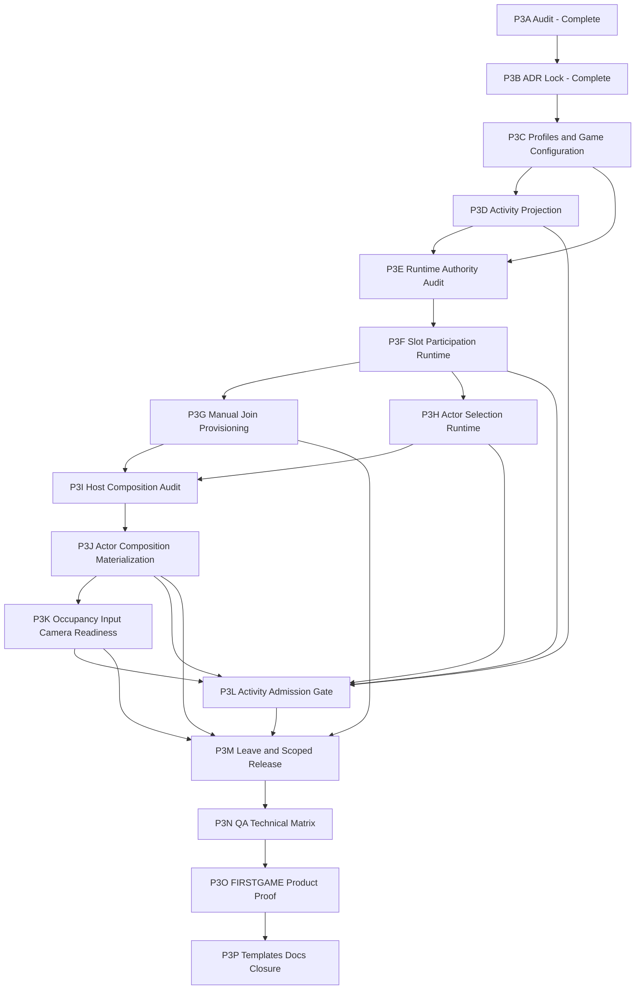

# P3 — Player Participation and Runtime Materialization — Incremental Implementation Plan

**Status:** Draft / Ready for execution review  
**Phase:** P3 — Player Participation, Local Join and Runtime Actor Materialization  
**Date:** 2026-07-12  
**Package:** `com.immersive.framework`  
**QA:** `rinnocenti/QAFramework`  
**Real consumer:** `ImmersiveGames/planet-devourer`  
**Unity baseline:** Unity 6.5 / Input System 1.19.0  
**Related:** P3A Conformance Audit; `ADR-PROD-0007` through `ADR-PROD-0012`

---

## 1. Objective

Implement the Player product lane as an incremental, authorable and diagnosable framework capability.

The final product flow must support:

```text
Game/Application defines ordered Player Slot Profiles
-> product explicitly requests local join
-> framework reserves the next eligible Slot
-> PlayerInputManager provisions the local Player host
-> framework binds Session participation
-> product selects or resolves an Actor Profile when appropriate
-> framework prepares the logical Actor composition
-> Activity admission verifies its required participation level
-> occupancy, input, camera and gameplay are enabled only when valid
-> context exit or explicit leave releases scoped runtime state
```

The framework must allow different product shapes:

```text
single-player with explicit default Actor
Press Start to Join
simultaneous character selection
lobby without gameplay Actors
delayed drop-in preparation
shared-camera local multiplayer
future split-screen integration
```

The framework does not implement one mandatory character-selection screen or one universal game workflow.

---

## 2. Current evidence

The P3A audit established that the package already contains the main identity and technical foundations:

```text
ActorId / ActorDeclaration / PlayerActorDeclaration
PlayerSlotId / PlayerSlotDeclaration
PlayerSlotOccupancy
PlayerEntry vocabulary
PlayerComposer / PlayerRecipe
PlayerControlRuntimeContext and input adapters
Camera request and target-source path
generic RuntimeContent materialization and release
```

The missing capability is the ordered runtime integration:

```text
Slot allocation
Session participation state
manual local join
Actor selection state
PlayerInputManager result admission
Actor-specific host composition
post-materialization occupancy/input/camera handoff
Activity participation admission
scoped release
```

P3 must reuse the existing foundations before introducing new runtime authorities or helpers.

---

## 3. Frozen product and architecture decisions

The following decisions are already accepted and are not reopened by this plan.

### 3.1 Participation layers

```text
PlayerSlotProfile
≠ joined participation
≠ selected ActorProfile
≠ contextual Activity projection
≠ logical Actor prepared
≠ effective occupancy
≠ gameplay readiness
```

### 3.2 Profiles

```text
PlayerSlotProfile
  immutable Slot identity and visual metadata

ActorProfile
  immutable selectable Actor identity and static product metadata

PlayerParticipationRequirementsProfile
  immutable reusable Activity admission policy
```

Runtime state references Profiles and never mutates them.

### 3.3 Local Player provisioning

```text
PlayerInputManager
  official Unity technical provisioner for local Player hosts
  manual join only
  no automatic input-driven join
```

The framework or an authorized product adapter explicitly requests join.

### 3.4 Slot allocation

```text
Game/Application owns an ordered PlayerSlotProfile[] configuration.

Default allocation:
  First Available By Configured Order
```

Reservation happens before `PlayerInputManager.JoinPlayer(...)`.

### 3.5 Player declaration

```text
PlayerActorDeclaration : ActorDeclaration
```

A Player host contains `PlayerActorDeclaration`, not both declaration components.

### 3.6 Actor selection and Activity requirements

Actor selection is not universally required to complete local join.

Every Activity references a mandatory `PlayerParticipationRequirementsProfile`.

Initial progressive requirement levels:

```text
None
JoinedSlots
SelectedActors
LogicalActorsPrepared
GameplayReady
```

The product decides how missing state is resolved. The framework evaluates and gates admission.

### 3.7 Capacity

```text
PlayerInputManager.maxPlayerCount
  serialized technical ceiling

Session dynamic join capacity
  mutable product policy
```

Reducing dynamic capacity blocks new joins and does not silently remove admitted Players.

### 3.8 Future online participation

Online/network admission is a separate future architecture.

It may reuse stable Slot, Actor and Profile identities but is not forced through the local `PlayerInputManager` path.

---

## 4. Execution principles

1. **No big-bang Player manager.** Add the smallest scoped authority proven necessary by the runtime audit.
2. **Audit before contract creation.** Request/result/context shapes are frozen only in the phase that inspects the relevant existing code.
3. **Package is the official solution.** QA proves technical contracts. FIRSTGAME proves real usability.
4. **One creation authority per local Player.** `PlayerInputManager` provisions the host; the framework does not instantiate a second local Player root.
5. **No timing folklore.** Do not wait one arbitrary frame. Pending join exists before `JoinPlayer`; admission starts from the explicit operation/result.
6. **No lifecycle from sibling `OnEnable`.** Unity component enable order is not framework authority.
7. **No silent defaults.** `null` never means permissive `None`; Actor selection defaults are explicit product configuration.
8. **No implicit lookup.** No name, tag, hierarchy or global service-locator resolution.
9. **Every phase compiles independently.** Each implementation cut has a narrow smoke and explicit rollback/failure evidence.
10. **ADRs evolve only at decision gates.** Implementation details do not become architecture by accident.

---

## 5. Decision gates

These gaps are intentionally scheduled instead of guessed now.

| Gate | Question | Closed in |
| --- | --- | --- |
| DG-P3-01 | What exact Activity participation projection selects the Slots evaluated by requirements? | P3D |
| DG-P3-02 | Which existing runtime scope can own Slot roster, capacity, pending joins and selection? Is a new context actually required? | P3E |
| DG-P3-03 | What is the minimum `LocalPlayerJoinRequest/Result` shape after inspecting current input adapters and operation patterns? | P3G |
| DG-P3-04 | Does Actor selection need only `Selected`, or also framework-level `Confirmed` state? | P3H |
| DG-P3-05 | Which content is fixed in `LocalPlayerHost`, which is Actor-specific, and which is Presentation? | P3I |
| DG-P3-06 | How is Actor-specific composition applied: child prefab, RuntimeContent, modules, composer materialization or a proven combination? | P3I |
| DG-P3-07 | Which existing input and camera bindings can be reconfigured after provisioning without requiring a scene-authored `PlayerComposer`? | P3K |
| DG-P3-08 | At which Activity transition stage are requirements evaluated, and how are `PendingResolution`, `Blocked` and `Failed` resumed/cancelled? | P3L |
| DG-P3-09 | What is the minimum explicit local leave/release operation without designing full reconnect or online lifecycle? | P3M |

No implementation phase may silently decide a gate assigned to a later phase.

---

## 6. Incremental phase map

| Phase | Type | Primary result | Status |
| --- | --- | --- | --- |
| P3A | Audit | Current conformance and real gaps | Completed |
| P3B | Product architecture / ADR | Participation, Profiles, manual join, ordered Slots and Activity requirements | Completed |
| P3C | Product authoring | Slot Profiles, Requirements Profiles and explicit Game/Application configuration | Planned |
| P3D | Product contract / authoring | Activity Participation Projection | Planned |
| P3E | Runtime audit / architecture gate | Reuse map and scoped participation authority decision | Planned |
| P3F | Runtime foundation | Slot roster, capacity, reservation and Session participation state | Planned |
| P3G | Runtime integration | Manual `PlayerInputManager` provisioning and join admission | Planned |
| P3H | Runtime product API | Actor selection state and product-facing selection operations | Planned |
| P3I | Audit / ADR gate | Fixed host versus Actor-specific composition boundary | Planned |
| P3J | Runtime materialization | ActorProfile-driven logical composition and release | Planned |
| P3K | Runtime integration | Occupancy, input, camera and GameplayReady evidence | Planned |
| P3L | Lifecycle integration | Activity participation admission gate | Planned |
| P3M | Runtime lifecycle | Explicit local leave and scoped release baseline | Planned |
| P3N | QA | End-to-end technical regression matrix | Planned |
| P3O | Real integration / UX | FIRSTGAME single-player and local-multiplayer product proof | Planned |
| P3P | Documentation / closure | Official templates, guide, diagnostics and phase closure | Planned |

---

# 7. Detailed phases

## P3A — Player Materialization Conformance Audit

**Status:** Completed  
**Type:** Audit / documentation

### Objective

Map the current Player, Actor, Slot, Composer, RuntimeContent, input and camera implementation without changing repositories.

### Accepted result

```text
existing identity foundations are reusable
generic RuntimeContent is reusable
Player materialization end-to-end is absent
product and topology assumptions require reconciliation
new identities or a generic global manager are not justified
```

### Files

```text
P3A-PLAYER-MATERIALIZATION-CONFORMANCE-AUDIT.md
```

### Acceptance

The current plan must preserve the audit’s central constraint:

```text
integrate existing contracts in order
do not redesign Player identity
```

### Suggested commit

```text
P3A — Player Materialization Conformance Audit
```

---

## P3B — Product Decision Lock

**Status:** Completed  
**Type:** Product architecture / ADR

### Objective

Freeze the product model before implementation.

### Scope

```text
Session participation composition
ActorProfile and PlayerSlotProfile
Profile versus Recipe versus runtime state
PlayerActorDeclaration inheritance
manual PlayerInputManager authority
ordered local Slot allocation
dynamic capacity policy
Activity participation requirement Profiles
```

### Files

```text
ADR-PROD-0007
ADR-PROD-0008
ADR-PROD-0009
ADR-PROD-0010
ADR-PROD-0011
ADR-PROD-0012
```

### Acceptance

The implementation plan must not collapse:

```text
Slot
selection
materialization
occupancy
readiness
```

into one “Player ready” boolean.

### Suggested commit

```text
Docs: freeze Player participation and local provisioning product model
```

---

## P3C — Slot and Activity Profile Authoring Foundation

**Type:** UX/product + runtime contracts  
**Dependencies:** P3B

### Objective

Create the first reusable authoring assets required by the accepted ADRs, without implementing join or Actor materialization.

### Scope

Create or finalize:

```text
PlayerSlotProfile
PlayerParticipationRequirementsProfile
PlayerParticipationRequirementLevel
explicit creation-menu entries
designer-first Inspectors
validation for missing/duplicate Profile identity
official Profile creation templates
```

Integrate an explicit ordered `PlayerSlotProfile[]` configuration into the appropriate existing Game/Application authoring surface.

### Pre-implementation audit

Before adding a new configuration asset, inspect:

```text
Game Application asset
framework settings
existing PlayerRecipe / PlayerComposer
Runtime/Common utilities
asset identity and validation helpers
existing CreateAssetMenu conventions
```

Prefer extending the correct existing Game/Application surface over adding a parallel “Player Settings” authority.

### Out of scope

```text
runtime Slot states
join request
PlayerInputManager bridge
Actor selection runtime
Actor composition reference
Activity admission evaluation
```

### Candidate files

```text
Runtime/PlayerParticipation/Authoring/PlayerSlotProfile.cs
Runtime/PlayerParticipation/Authoring/PlayerParticipationRequirementsProfile.cs
Runtime/PlayerParticipation/Contracts/PlayerParticipationRequirementLevel.cs
Editor/PlayerParticipation/PlayerSlotProfileEditor.cs
Editor/PlayerParticipation/PlayerParticipationRequirementsProfileEditor.cs
Editor/PlayerParticipation/PlayerParticipationAuthoringValidator.cs
existing Game/Application authoring file discovered by audit
```

Exact paths must follow existing assembly and folder conventions found in the package.

### Product surface

```text
Create > Immersive Framework > Player > Player Slot Profile
Create > Immersive Framework > Player > Participation Requirements Profile
Game/Application Inspector > Local Player Slots [ordered]
```

### Expected use

```text
designer creates Player 1 / Player 2 Profiles
-> assigns name, accent color and icon
-> orders them in Game/Application
-> creates explicit None / Joined / Selected / Prepared / Gameplay Profiles
```

### Technical smoke

```text
Profile identity normalizes correctly
duplicate PlayerSlotId is rejected
ordered configuration preserves authoring order
missing Profile reference is invalid
None is represented by an explicit Profile, not null
Profile assets are not mutated in Play Mode
```

### Technical acceptance

```text
runtime assemblies do not depend on Editor
no serialized inline default silently creates requirements
no duplicate identity strings are authored outside the owning Identity Profile
```

### Product acceptance

```text
designer can author Slot color/icon before any Actor exists
designer can reuse one requirements asset across Activities
forgetting configuration fails visibly
```

### Architectural gain

Establishes reusable product intent before mutable runtime state.

### Usability gain

Makes local-player seats and Activity requirements visible and repeatable in authoring.

### Suggested commit

```text
P3C — Add Player Slot and Activity participation Profile authoring
```

---

## P3D — Activity Participation Projection

**Type:** Product contract + UX/product  
**Dependencies:** P3C  
**Decision gate:** DG-P3-01

### Objective

Define which Session Slots an Activity evaluates against its requirements Profile.

### Audit first

Inspect the existing Activity and Route authoring/runtime model:

```text
Activity assets and composers
Activity participation/content fields
Route/Activity runtime scope
current Activity readiness/admission stages
required/optional content patterns
existing collection/profile references
```

### Decision to close

Choose the minimum product shape that supports current products without introducing MMO/team topology prematurely.

The initial candidate should express:

```text
all currently Joined Slots
or
an explicit Activity projection/subset
```

The decision must also define whether zero participants are valid and whether a minimum count belongs in the projection or requirements Profile.

### Recommended starting direction

```text
Requirements Profile
  defines required readiness level

Activity Participation Projection
  defines which Slots are evaluated
```

Do not store contextual Slot identities inside the reusable Requirements Profile.

### Scope after decision

Create:

```text
ActivityParticipationProjectionProfile or equivalent proven shape
Activity reference to projection
projection validation
projection evaluation descriptor
Advanced/Debug summary
```

A dedicated Profile is preferred if the same projection policy is reusable. An inline typed reference is acceptable only if the audit proves it is identity-specific and not reusable.

### Out of scope

```text
runtime join
Actor selection
materialization
online party/team assignment
spectators
account-bound slots
```

### Candidate files

```text
Runtime/PlayerParticipation/Authoring/ActivityParticipationProjectionProfile.cs
Runtime/PlayerParticipation/Contracts/ActivityParticipationProjectionDescriptor.cs
existing Activity authoring asset/component
Editor/PlayerParticipation/ActivityParticipationProjectionValidator.cs
ADR-PROD-0012 update or a new ADR only if the boundary expands
```

### Expected use

```text
Character Selection Activity
  Projection: all Joined Slots
  Requirements: JoinedSlots

Gameplay Activity
  Projection: all participating Joined Slots
  Requirements: GameplayReady
```

### Technical smoke

```text
projection resolves deterministically
missing projection blocks Activities that require participants
projection never derives Slot identity from Unity playerIndex
zero-participant behavior is explicit
```

### Acceptance

```text
Profile level and Slot projection remain separate
Activity owns contextual participation requirements
Route evaluates but does not author Activity requirements
```

### Suggested commit

```text
P3D — Define Activity Player participation projection
```

---

## P3E — Runtime Reuse and Authority Audit

**Type:** Technical audit / architecture decision  
**Dependencies:** P3C, P3D  
**Decision gate:** DG-P3-02

### Objective

Determine where mutable Player participation state belongs by inspecting current runtime contexts instead of creating a new manager by assumption.

### Required inspection

```text
FrameworkRuntimeHost
GameFlowRuntime
Route runtime context/scope/root
Activity runtime context/scope/root
PlayerEntry and PlayerEntryBehaviour
PlayerControlRuntimeContext
PlayerSlotOccupancy and topology sets
RuntimeContent runtime/registry/handles
existing operation/result conventions
existing diagnostics and snapshot patterns
Runtime/Common helpers
```

### Questions to answer

```text
Does an existing Session/Application context have the correct lifetime?
Can Player participation be a scoped module owned by that context?
Is a new PlayerParticipationContext required?
How is typed access provided without a service locator?
Which state survives Route changes?
Which state is Route/Activity-owned?
How are snapshots and diagnostics exposed?
```

### Output

One audit document containing:

```text
reuse map
authority matrix
lifetime diagram
state ownership table
API candidates
files to reuse
files that must not be expanded
decision on new context versus existing scoped module
```

Create or amend an ADR only if a new public/scoped runtime authority is accepted.

### Out of scope

```text
implementation
join request shape
PlayerInputManager calls
Actor composition
Activity gate code
```

### Files

```text
Documentation~/Product/P3E-PLAYER-PARTICIPATION-RUNTIME-AUTHORITY-AUDIT.md
optional ADR-PROD-0013 only when an authority boundary is accepted
```

### Acceptance

```text
PlayerControlRuntimeContext remains per admitted Player
no global singleton/service locator is introduced
Session-persistent state and Activity-scoped state are separated
new helpers are not created before checking Runtime/Common
```

### Suggested commit

```text
P3E — Audit Player participation runtime authority
```

---

## P3F — Session Slot Runtime and Reservation

**Type:** Technical foundation  
**Dependencies:** P3E

### Objective

Implement mutable Session participation state without performing Unity Player creation.

### Scope

Implement the accepted scoped owner with:

```text
ordered configured Slot Profiles
Slot allocation states:
  Unavailable
  Available
  Reserved
  Joined
  Leaving

dynamic join capacity
join window state
atomic first-available reservation
reservation release
optional selected ActorProfile reference
typed snapshots
typed operation results
diagnostics
```

### Required operations

Conceptual operations:

```text
TrySetDynamicCapacity
TryOpenJoining
TryCloseJoining
TryReserveNextAvailableSlot
TryReleaseReservation
TryMarkJoined
TryGetSlotState
TryGetParticipationSnapshot
```

Names and result shapes follow the patterns found in P3E.

### Out of scope

```text
PlayerInputManager
device pairing
Actor materialization
camera/input gameplay binding
explicit leave destruction
online identity
```

### Candidate files

```text
Runtime/PlayerParticipation/Contracts/PlayerSlotAllocationState.cs
Runtime/PlayerParticipation/Contracts/PlayerParticipationSnapshot.cs
Runtime/PlayerParticipation/Contracts/PlayerParticipationOperationResult.cs
Runtime/PlayerParticipation/Runtime/<accepted scoped context>.cs
Runtime/PlayerParticipation/Diagnostics/*
```

### Expected flow

```text
Session starts
-> configured Profiles become Available/Unavailable
-> capacity is applied
-> request reserves first eligible Slot
-> failed operation releases reservation
```

### Technical smoke

```text
first configured Available Slot is reserved
two same-frame requests cannot reserve one Slot
capacity increase enables eligible Slots
capacity reduction blocks new joins without eviction
foreign/stale reservation is rejected
reservation rollback is idempotent
Profile assets remain unchanged
```

### Technical acceptance

```text
no PlayerInput or GameObject is required for Slot state tests
identity comes from PlayerSlotProfile/PlayerSlotId
all mandatory failures are explicit
```

### Product acceptance

```text
ordered Slot colors/icons are available from runtime snapshots
product can show lobby seats before Actor selection
```

### Suggested commit

```text
P3F — Add scoped Player Slot participation runtime
```

---

## P3G — Manual Local Join Provisioning

**Type:** Runtime integration  
**Dependencies:** P3F  
**Decision gate:** DG-P3-03

### Objective

Connect explicit product join requests to `PlayerInputManager.JoinPlayer(...)` without reimplementing Unity Input System responsibilities.

### Pre-implementation audit

Inspect:

```text
current Input System adapters
PlayerInput Gate and InputMode integration
PlayerControlRuntimeContext binding APIs
operation/request/result conventions
authoring reference patterns for PlayerInputManager
Input System 1.19.0 JoinPlayer overloads used by the project
current local Player prefab constraints
```

### Decision to close

Freeze the minimum request/result fields actually required.

Candidate request intent:

```text
reason/source
context owner evidence
optional device(s)
optional control scheme
optional selected ActorProfile
```

The ordinary request does not name a Slot. P3F reserves the next eligible Slot.

Avoid adding `playerIndex` or `splitScreenIndex` unless a concrete product path requires explicit control.

### Scope

Implement:

```text
typed provisioning bridge
explicit PlayerInputManager reference/injection
manual join validation
pending join operation created before JoinPlayer
Slot reservation correlation
JoinPlayer result correlation
joined callback confirmation/divergence detection
PlayerActorDeclaration and PlayerInput validation
ActorId/Slot binding evidence
Joined state commit
failure rollback
unexpected external join rejection
```

### Out of scope

```text
automatic join
online join
full disconnect/reconnect
Actor-specific composition
gameplay camera
split-screen product layout
```

### Candidate files

```text
Runtime/PlayerParticipation/Contracts/LocalPlayerJoinRequest.cs
Runtime/PlayerParticipation/Contracts/LocalPlayerJoinResult.cs
Runtime/PlayerParticipation/Runtime/LocalPlayerProvisioningBridge.cs
Runtime/PlayerParticipation/Authoring/LocalPlayerProvisioningAuthoring.cs
Editor/PlayerParticipation/LocalPlayerProvisioningValidator.cs
```

### Expected flow

```text
authorized request
-> reserve next Slot
-> create Pending Join
-> call JoinPlayer
-> receive PlayerInput or null
-> validate PlayerActorDeclaration
-> bind Slot/Actor identity evidence
-> commit Joined
```

### Technical smoke

```text
manual single-player join succeeds
second join receives next Slot
JoinPlayer null releases reservation
missing PlayerActorDeclaration blocks and rolls back
missing PlayerInput blocks and rolls back
callback without pending operation is rejected
playerIndex is diagnostic evidence only
no arbitrary frame delay is used
```

### Acceptance

```text
PlayerInputManager remains the only local Player root provisioner
framework does not pair devices or clone Actions itself
framework does not use PlayerInputManager.instance throughout runtime
```

### Suggested commit

```text
P3G — Add manual local Player provisioning bridge
```

---

## P3H — Actor Selection Runtime

**Type:** Runtime product API  
**Dependencies:** P3F, P3G  
**Decision gate:** DG-P3-04

### Objective

Allow the product to select an `ActorProfile` before or after join without coupling selection to occupancy or materialization.

### Audit and decision

Inspect real FIRSTGAME selection/default needs and existing command/state patterns.

Decide whether the framework needs:

```text
Unselected
Selected
```

only, or whether a reusable product need proves:

```text
Selected
Confirmed
```

Do not introduce `Confirmed` merely because selection screens often have a confirm button. Confirmation may remain product UI state unless framework admission needs it.

### Scope

Implement the minimal accepted operations:

```text
TrySelectActorProfile
TryReplaceActorSelection
TryClearActorSelection when current Activity policy allows
TryGetActorSelection
selection changed evidence
```

If explicit default selection is supported, it must be configured and diagnosed as a product policy; never inferred.

### Out of scope

```text
Actor materialization
unique-character rules
team restrictions
loadout/progression
online account selection
```

### Candidate files

```text
Runtime/PlayerParticipation/Contracts/PlayerActorSelectionState.cs
Runtime/PlayerParticipation/Contracts/PlayerActorSelectionResult.cs
existing scoped participation runtime
optional product adapter contract for defaults/selection UI
```

### Technical smoke

```text
Joined Slot may remain Unselected
selection can be assigned after join
selection can exist before join only when policy explicitly supports it
foreign Slot selection is rejected
null/invalid ActorProfile does not become a silent default
Profile replacement produces explicit previous/current evidence
```

### Product acceptance

```text
single-player product can apply an explicit default
selection screen can assign different Profiles simultaneously
Slot pointer color remains independent from Actor choice
```

### Suggested commit

```text
P3H — Add Player Actor selection runtime operations
```

---

## P3I — Local Player Host Composition Audit and Decision

**Type:** Technical/product audit + ADR gate  
**Dependencies:** P3G, P3H  
**Decision gates:** DG-P3-05, DG-P3-06

### Objective

Determine how the Actor selected by `ActorProfile` completes the stable local Player host created by `PlayerInputManager`.

### Working hypothesis

```text
PlayerInputManager
  creates a stable LocalPlayerHost

ActorProfile
  supplies Actor-specific logical composition after join

Presentation/Skin
  remains a separate visual materialization layer
```

This hypothesis is not permission to assume that every variable component can live in a child prefab.

### Required code audit

Classify current components and dependencies:

```text
PlayerActorDeclaration
PlayerInput
PlayerComposer-generated bindings
movement/control adapters
attributes/capabilities
reset participants
camera target sources
LocalPlayerCameraRequestBinding
RequireComponent usage
GetComponent on same GameObject
GetComponentInChildren dependencies
hierarchy assumptions
RuntimeContent child materialization
release adapters
Composer Apply/Rebuild utilities
```

For each component, classify:

```text
Fixed Host
Actor Logical Composition
Presentation
Activity/Context Binding
Game-owned optional behavior
```

### Options to evaluate

```text
RuntimeContent-managed child logical composition
typed modules attached to a fixed host
explicit host adapters bound to child implementations
Composer/Recipe materialization into prefab authoring
a proven combination
```

Reject:

```text
changing PlayerInputManager.playerPrefab per concurrent join
second Player root instantiated by RuntimeContent
uncontrolled AddComponent lists from serialized type names
runtime reflection-based composition
```

### Output

```text
component classification matrix
dependency graph
recommended materialization mechanism
idempotency/release model
ActorProfile field shape
required adapter boundaries
ADR-PROD-0008 amendment or new ADR
implementation file list for P3J
```

### Files

```text
Documentation~/Product/P3I-LOCAL-PLAYER-HOST-COMPOSITION-AUDIT.md
ADR update/new decision document
```

### Acceptance

```text
decision is grounded in current components
fixed host remains valid before Actor selection
Actor-specific composition can be replaced/released explicitly
Presentation remains separable
```

### Suggested commit

```text
P3I — Decide Local Player Host composition boundary
```

---

## P3J — ActorProfile Logical Composition Materialization

**Type:** Runtime materialization + product authoring  
**Dependencies:** P3I

### Objective

Implement the composition mechanism accepted in P3I.

### Scope

Finalize `ActorProfile` as a usable product asset:

```text
stable ActorProfile identity
display metadata
explicit logical composition reference
optional explicit default Presentation reference when the Presentation system exists
compatibility/validation metadata proven necessary by P3I
```

Implement:

```text
resolve selected ActorProfile
materialize/apply Actor-specific logical composition
bind composition to PlayerActorDeclaration
assign/confirm ActorId
produce typed materialization handle/evidence
idempotent already-applied behavior
replace selection only through an explicit operation
release/rollback on failure
diagnostics
```

Reuse RuntimeContent where proven appropriate.

### Out of scope

```text
full Presentation/Skin port when not yet available
game-specific movement implementation
character uniqueness rules
network spawning
```

### Candidate files

Final names come from P3I. Expected areas:

```text
Runtime/PlayerParticipation/Authoring/ActorProfile.cs
Runtime/PlayerParticipation/Runtime/PlayerActorComposition*
Runtime/RuntimeContent extensions/adapters only when generic contracts are insufficient
Editor/PlayerParticipation/ActorProfileEditor.cs
Editor/PlayerParticipation/ActorProfileValidator.cs
```

### Technical smoke

```text
selected Profile materializes the expected composition
same Profile apply is idempotent
replacement releases previous composition in order
invalid composition blocks without partial readiness
ActorId remains owned by the Profile/declaration model
two Players may use independent composition instances
```

### Product acceptance

```text
Player can join before selecting an Actor
selection later creates the intended logical character
single-player explicit default follows the same path
```

### Suggested commit

```text
P3J — Materialize Player Actor composition from ActorProfile
```

---

## P3K — Post-Materialization Bindings and Gameplay Readiness

**Type:** Runtime integration  
**Dependencies:** P3J  
**Decision gate:** DG-P3-07

### Objective

Connect the prepared logical Player Actor to existing occupancy, input, camera and readiness contracts without reintroducing obsolete passive topology wholesale.

### Audit first

Inspect and reuse:

```text
PlayerSlotOccupancy
PlayerControlRuntimeContext
UnityPlayerInputGateAdapter
PlayerControlBinding adapters
Camera target-source contracts
LocalPlayerCameraRequestBinding
CameraOutputSessionBinding
Runtime scope/request identity patterns
existing release ordering
```

### Scope

Implement the smallest official handoff:

```text
confirm effective Slot -> Actor occupancy
record PlayerControlRuntimeContext binding evidence
configure allowed UI/gameplay Action Map or gate state
resolve live camera targets from the provisioned instance
publish camera request only when eligible
produce LogicalActorsPrepared evidence
produce GameplayReady evidence
release bindings in reverse order
```

Do not require a scene-authored `PlayerComposer` if runtime typed evidence can supply the same targets and bindings.

Do not make per-Player camera universally mandatory.

### Out of scope

```text
movement engine
shared-versus-split camera product policy
full Presentation implementation when unavailable
online authority
```

### Candidate files

```text
Runtime/PlayerParticipation/Runtime/PlayerActorAdmissionOrchestrator.cs
Runtime/PlayerParticipation/Contracts/PlayerGameplayReadinessSnapshot.cs
targeted adapters in PlayerBinding/Camera only when existing APIs cannot accept runtime evidence
```

### Technical smoke

```text
occupancy is confirmed only after valid Actor preparation
foreign/stale Slot or Actor is rejected
gameplay input remains blocked before readiness
camera request publishes only after eligibility
camera/input release is idempotent
missing optional camera does not fail an Activity that does not require it
```

### Technical acceptance

```text
occupancy is not the spawner
PlayerControlRuntimeContext remains per Player
camera winner remains owned by Camera Output Context
no name/hierarchy lookup is added
```

### Suggested commit

```text
P3K — Bind prepared Player Actors to occupancy input and camera
```

---

## P3L — Activity Participation Admission Gate

**Type:** Lifecycle integration  
**Dependencies:** P3D, P3F, P3H, P3J, P3K  
**Decision gate:** DG-P3-08

### Objective

Prevent an Activity from becoming active until its projection and participation requirements are satisfied.

### Pipeline audit

Identify:

```text
target Activity resolution stage
existing validation/readiness gates
transition effect ordering
content materialization stages
Activity enter/active boundary
cancellation/resume patterns
diagnostic/result conventions
```

### Decision to close

Define exact semantics for:

```text
Satisfied
PendingResolution
Blocked
Failed
```

At minimum:

```text
Satisfied
  transition continues

PendingResolution
  product-owned selection/preparation is legitimately in progress

Blocked
  valid product state does not satisfy policy

Failed
  invalid authoring or technical failure
```

Decide whether pending transitions resume by explicit retry/request or a scoped continuation mechanism already present in the framework. Do not invent a background waiter or hidden polling loop.

### Scope

Implement:

```text
mandatory Requirements Profile resolution
Activity projection evaluation
per-Slot progressive level evaluation
typed issue/result aggregation
transition blocking
explicit retry/resume path
Advanced/Debug evidence
```

### Out of scope

```text
selection UI
automatic navigation to a selection Activity
workflow engine
online party readiness
```

### Technical smoke

```text
None Activity activates with explicit None Profile
JoinedSlots passes with joined unselected Slots
SelectedActors blocks an unselected required Slot
LogicalActorsPrepared blocks partial composition
GameplayReady blocks missing required binding evidence
missing Profile fails authoring/runtime explicitly
projection excludes non-participating Slots correctly
retry succeeds after product resolves missing selection
```

### Product acceptance

```text
simple product can use explicit default Actor
selection product can join first and select later
gameplay never starts with unresolved required Players
```

### Suggested commit

```text
P3L — Gate Activity activation by Player participation requirements
```

---

## P3M — Local Leave and Scoped Release Baseline

**Type:** Runtime lifecycle  
**Dependencies:** P3G, P3J, P3K, P3L  
**Decision gate:** DG-P3-09

### Objective

Provide the minimum explicit local leave/release behavior needed to return a Slot to `Available` and avoid leaked runtime state.

### Audit and decision

Inspect `PlayerInputManager` leave notifications, current release adapters and Route/Activity exit ordering.

Freeze only the local nominal baseline:

```text
explicit product leave
context-owned Player release
unexpected PlayerInput destruction reconciliation
```

Do not design full device-loss recovery, reconnect, account persistence or online migration.

### Scope

Required release order should be explicit and validated. Candidate order:

```text
block gameplay/input eligibility
release camera request
release contextual occupancy
release Actor-specific composition
unbind PlayerControlRuntimeContext
release/destroy PlayerInput through the accepted Unity path
clear Session joined evidence
return Slot to Available when policy allows
```

The final order must follow existing subsystem contracts found during implementation.

### Capacity rule

Reducing dynamic capacity remains non-destructive.

Leave occurs only through an explicit leave/release operation or contextual owner exit.

### Technical smoke

```text
explicit leave returns Slot to Available
next join reuses the earliest Available Slot
double leave is idempotent/rejected explicitly
context exit releases owned Player state
capacity reduction alone does not invoke leave
destroyed PlayerInput is reconciled diagnostically
```

### Suggested commit

```text
P3M — Add explicit local Player leave and scoped release baseline
```

---

## P3N — QA Technical Matrix

**Type:** QA technical  
**Dependencies:** P3C through P3M

### Objective

Prove package contracts in `QAFramework` using synthetic, isolated fixtures.

### QA scenes/assets

Use:

```text
Assets/ImmersiveFrameworkQA/
```

Create isolated Profiles, Player prefabs and scenes for P3. Do not depend on FIRSTGAME assets.

### Required smoke groups

#### Authoring

```text
Profile creation/validation
ordered Slot configuration
missing Activity Profiles
projection validation
ActorProfile composition validation
```

#### Slot runtime

```text
first available allocation
same-frame atomic reservation
capacity increase/decrease
reservation rollback
foreign/stale operations
```

#### Manual join

```text
single join
two joins
technical max reached
JoinPlayer failure rollback
unexpected external join
no one-frame timing dependency
```

#### Selection/materialization

```text
join without Actor
select after join
explicit default selection
materialize composition
replace/release composition
partial failure rollback
```

#### Admission

```text
None
JoinedSlots
SelectedActors
LogicalActorsPrepared
GameplayReady
Pending/Blocked/Failed
retry after resolution
```

#### Bindings/release

```text
occupancy
input gate
camera eligibility
Activity/Route exit
explicit leave
idempotent release
```

### Negative cases

```text
duplicate PlayerSlotId
duplicate ActorProfile identity
missing PlayerActorDeclaration
missing PlayerInput
invalid host composition
missing Requirements Profile
stale reservation
foreign Slot/Actor
unexpected callback
```

### Acceptance

```text
all mandatory smokes pass
no silent fallback
diagnostics identify Slot Profile, Actor Profile, operation and reason
QA proves technical behavior without becoming the product UI
```

### Suggested commit

```text
P3N — Add Player participation and materialization QA matrix
```

---

## P3O — FIRSTGAME Product Proof

**Type:** Real integration / UX/product  
**Dependencies:** P3N

### Objective

Prove that the package is usable in a real game without rebuilding internal contracts in the consumer.

### Proof 1 — Single-player explicit default

```text
Game/Application has one PlayerSlotProfile
-> product requests manual join
-> framework assigns Slot 1
-> explicit default ActorProfile is selected
-> logical Actor is prepared
-> Gameplay Activity requirements pass
-> existing movement and camera integrations remain usable
```

### Proof 2 — Local multiplayer selection

```text
Game/Application has at least two ordered Slot Profiles
-> product exposes Press Start/Join commands
-> first and second Players receive deterministic Slots
-> UI pointers use Slot colors/icons
-> Players select ActorProfiles independently
-> required Activity gate blocks until both required selections/preparation pass
-> gameplay uses an explicit supported camera policy
```

Split-screen is not mandatory for this proof. Shared camera or another explicitly configured output is acceptable. `PlayerInputManager` split-screen product integration remains a separate camera cut unless required by the chosen proof.

### Consumer boundaries

FIRSTGAME may contain:

```text
selection UI
pointer rendering
game-specific movement
character-specific capabilities
explicit default-selection adapter
game-specific camera policy
```

FIRSTGAME must not contain permanent replacements for:

```text
Slot allocation
join correlation
Session participation authority
Activity requirements evaluation
Actor composition lifecycle
occupancy/input/camera admission contracts
```

Permanent generic solutions discovered in FIRSTGAME migrate to the package.

### Acceptance

```text
designer can create and configure the flow using package assets/components
no consumer name/tag/hierarchy lookup
no duplicate Player manager
no consumer-owned Slot allocator
package diagnostics explain failures
```

### Suggested commit

```text
P3O — Prove Player participation flows in FIRSTGAME
```

---

## P3P — Official Templates, Usage Guide and Closure

**Type:** Documentation / UX/product closure  
**Dependencies:** P3N, P3O

### Objective

Make the completed capability discoverable and repeatable.

### Package deliverables

```text
Create menu entries
official Profile templates:
  Player Slot 1..4 examples
  Participation None
  Participation Joined
  Participation Selected
  Participation Prepared
  Participation Gameplay Ready

Local Player Host prefab/template
sample or template for single-player default flow
sample or template for join-then-select flow
short usage guide
Advanced/Debug guide
failure/diagnostic reference
ADR and Current documentation updates
execution status update
```

### Guide flow

```text
1. Create PlayerSlotProfiles.
2. Add them in order to Game/Application.
3. Configure PlayerInputManager for manual join.
4. Assign the official Local Player Host prefab.
5. Create Requirements Profiles.
6. Assign Projection + Requirements to Activities.
7. Request join from product UI/adapter.
8. Select/default ActorProfile.
9. Observe admission diagnostics.
```

### Closure criteria

Technical:

```text
package compiles
QA matrix passes
no silent fallback
release order is explicit
contracts preserve Actor/Slot separation
```

Product:

```text
user can create the feature
user can configure the feature
Inspector is understandable
required assets cannot be silently omitted
Advanced/Debug exposes evidence
FIRSTGAME proves real use
official sample/template exists
```

### Suggested commit

```text
P3P — Close Player participation and materialization product lane
```

---

## 8. Dependency flow



---

## 9. Deferred beyond P3

The following are not required to close the local Player product lane:

```text
online/network admission
cross-client authority
account-bound Player Slots
full device disconnect/reconnect recovery
persistent Player selection save
unique-character/team drafting policies
automatic join
MMO Slot assignment
runtime reflection composition
global Player service locator
mandatory split-screen
possession of several simultaneous Actors
spectator architecture
```

These future systems must preserve:

```text
PlayerSlotProfile identity
ActorProfile identity
Session participation layering
Activity requirements
explicit admission/release
```

---

## 10. Plan acceptance

This implementation plan is accepted when:

```text
every unresolved architecture question has a scheduled decision gate
no large runtime authority is created before the P3E audit
the join contract is not frozen before P3G evidence
the LocalPlayerHost composition mechanism is not guessed before P3I
Activity admission is not implemented before projection and readiness facts exist
QA precedes FIRSTGAME technical dependence
FIRSTGAME proves usability rather than inventing package contracts
each implementation phase has a focused smoke and explicit acceptance criteria
```

---

## 11. Suggested plan commit

```text
Docs: add incremental P3 Player participation and materialization plan
```
